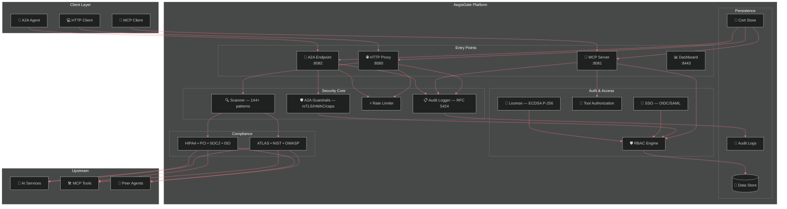

<div align="center">

# 🛡️ AegisGate Security Platform™ — Secure Every AI Interaction

[](https://github.com/aegisgatesecurity/aegisgate-platform/releases)
[](LICENSE)
[](https://golang.org/)
[](SECURITY.md)
[](https://github.com/aegisgatesecurity/aegisgate-platform/actions)
[](https://github.com/aegisgatesecurity/aegisgate-platform/actions)
[](Dockerfile)

> The only AI security platform with native HTTP API, MCP, **and** A2A protection. Three pillars. One gateway. Zero external dependencies.

[🌐 Website](https://aegisgatesecurity.io) • [📊 Pricing](https://aegisgatesecurity.io/pricing/) • [📚 Docs](docs/) • [🔒 Security](SECURITY.md) • [💬 Discussions](https://github.com/aegisgatesecurity/aegisgate-platform/discussions)

</div>

---

## The Problem

Your AI infrastructure spans **three attack surfaces** — and most teams are only protecting one:

| Attack Surface | Risk | Conventional Tools |
|---|---|---|
| **HTTP APIs** | Prompt injection, data leakage, PII exposure | ✅ WAFs exist |
| **MCP Protocol** | Tool poisoning, session hijacking, supply-chain attacks | ❌ No native protection |
| **A2A Communication** | Agent impersonation, data tampering, capability escalation | ❌ No solution exists |

AegisGate secures **all three** in a single 20 MB binary you deploy in 60 seconds.

---

## Three Pillars of AI Security

### 🌐 HTTP API Security

Bidirectional scanning of every request and response with 144+ detection patterns:

- **144+ detection patterns** — MITRE ATLAS, OWASP LLM Top 10, PII/secrets/credentials
- **Bidirectional inspection** — scans both requests and responses
- **Rate limiting** — per-client, per-IP quotas with token-bucket algorithm
- **Circuit breaker** — automatic failure recovery
- **Tamper-evident audit** — RFC 5424-compliant structured logging

### 🔗 MCP Protocol Protection

Session authentication, tool authorization, and 8 guardrails for every MCP connection:

| Guardrail | What It Does |
|-----------|-------------|
| **Session Authentication** | Auth required for all MCP sessions |
| **Concurrent Session Limits** | Max 10 simultaneous sessions per client |
| **Tools per Session** | Max 50 tools available per session |
| **STDIO Validation** | Command injection prevention |
| **Execution Timeout** | Max 60-second tool execution |
| **Memory Monitoring** | Alerts at 80% memory threshold |
| **Per-Client RPM** | Max 1,000 requests/minute per client |
| **Tool Authorization** | Risk-based tool call approval with authorization matrix |

### 🤝 A2A Agent-to-Agent Security

Zero-trust guardrails for inter-agent communication — the first purpose-built A2A security layer:

| Guardrail | What It Does |
|-----------|-------------|
| **mTLS Authentication** | Verifies X.509 certificates; extracts agent identity from CommonName |
| **HMAC-SHA256 Integrity** | Validates A2A-Signature header covering full request body |
| **Capability Enforcement** | Enforces least-privilege per agent from capability configuration |
| **Token-Bucket Rate Limiting** | Per-agent request quotas (default 100 req/min) |
| **Request Size Limits** | Rejects bodies > 2 MiB (413 Payload Too Large) |
| **Timeout Enforcement** | Cancels requests exceeding configurable timeout (default 30 s) |
| **Optional License Validation** | Cryptographic ECDSA P-256 license enforcement for commercial tiers |
| **Audit Logging** | RFC 5424 structured log per request with agent ID and guard-rail outcomes |

---

## 🔐 Enterprise Authentication

AegisGate ships production-grade SSO and access control — not stubs:

| Feature | Details |
|---------|---------|
| **OIDC / OAuth 2.0** | Full OpenID Connect with PKCE; auto-discovery of provider endpoints |
| **SAML 2.0** | SP-initiated login; pre-configured for **Azure AD**, **Okta**, and **Google Workspace** |
| **RBAC** | Role-based access control with session-scoped permissions |
| **Tool Authorization** | Risk-weighted authorization matrix controls which tools each role can invoke |
| **License Enforcement** | ECDSA P-256 cryptographic validation; community tier works license-free |
| **API Key Fallback** | Key-based auth for service accounts and CI/CD pipelines |

> **Community tier** includes core proxy, MCP guardrails, and A2A guardrails — license-free.
> SSO, RBAC, and compliance modules are available on commercial tiers. See [aegisgatesecurity.io/pricing](https://aegisgatesecurity.io/pricing/).

---

## 📊 Compliance Frameworks

AegisGate maps security controls to 13 compliance frameworks:

| Framework | Coverage | |
|-----------|----------|-|
| **MITRE ATLAS** | All AI-specific adversarial techniques | Community |
| **NIST AI RMF 1.500** | Complete AI risk management | Community |
| **OWASP LLM Top 10** | LLM01–LLM10 coverage | Community |
| **ISO 27001** | Information security management | Professional |
| **GDPR** | Data protection and PII handling | Developer |
| **HIPAA** | Healthcare data protection / PHI detection | Developer |
| **PCI-DSS** | Payment card security / tokenization | Developer |
| **SOC2 Type II** | Continuous monitoring and evidence collection | Professional |
| **ISO 42001** | AI management systems | Professional |

> All framework modules are fail-closed — if a compliance check cannot be evaluated, the request is blocked.

---

## 🏗️ Architecture



---

## 🚀 Quick Start

### Docker

```bash
docker run -d \
  -p 8080:8080 \
  -p 8081:8081 \
  -p 8443:8443 \
  -e AEGISGATE_A2A_ENABLED=true \
  ghcr.io/aegisgatesecurity/aegisgate-platform:latest
```

### Kubernetes (Helm)

```bash
helm repo add aegisgate https://aegisgatesecurity.github.io/aegisgate-platform
helm install aegisgate aegisgate/aegisgate-platform
```

The Helm chart includes **HPA autoscaling** (1–10 replicas), **NetworkPolicy** ingress/egress restrictions, **ServiceMonitor** for Prometheus, and rolling update strategy.

<details>
<summary>Advanced Helm values</summary>

```yaml
# values.yaml
replicaCount: 2
autoscaling:
  enabled: true
  minReplicas: 1
  maxReplicas: 10
  targetCPUUtilizationPercentage: 80

persistence:
  enabled: true
  size: 10Gi

serviceMonitor:
  enabled: true

networkPolicy:
  enabled: true
```

</details>

### Verify

```bash
curl http://localhost:8443/health
open https://localhost:8443  # Dashboard
```

---

## ⚡ Performance

| Metric | Result |
|--------|--------|
| **Peak Throughput** | 11,681 RPS |
| **Average Latency** | 2.44 ms |
| **P95 Latency** | 3.64 ms |
| **Error Rate** | 0.00% |
| **Binary Size** | 20 MB |
| **Package Test Coverage** | 87.1% |
| **Tests Passing** | 1,394 |
| **CVEs** | 0 |

*Load testing methodology in [PERFORMANCE.md](PERFORMANCE.md).*

---

## 🛠️ Configuration

### Zero-Config (Just Run)

```bash
aegisgate-platform --embedded-mcp
```

AegisGate auto-detects OpenAI, Anthropic, Azure, and AWS Bedrock. Auto-generates TLS certificates. Works immediately.

### SSO Configuration

```yaml
# aegisgate-platform.yaml
sso:
  oidc:
    enabled: true
    issuer_url: https://login.microsoftonline.com/<tenant>/v2.0
    client_id: your-client-id
    client_secret: your-client-secret
  saml:
    enabled: true
    idp_metadata_url: https://your-idp/metadata
    sp_entity_id: https://your-domain/sp
```

Pre-configured provider templates for **Azure AD**, **Okta**, and **Google Workspace**.

### A2A Configuration

```yaml
a2a:
  enabled: true
  mTLS:
    enabled: true
    cert_file: /data/a2a-client.crt
    key_file: /data/a2a-client.key
    ca_file: /data/a2a-ca.crt
  hmac:
    enabled: true
    secret: ${A2A_HMAC_SECRET}
  capabilities_file: configs/a2a_caps.yaml
```

<details>
<summary>Full configuration reference</summary>

```yaml
proxy:
  bind_address: :8080
  upstream_url: https://api.openai.com

server:
  port: 8443

mcp:
  enabled: true
  port: 8081

a2a:
  enabled: true
  port: 8082

persistence:
  data_dir: /data
  enabled: true

sso:
  oidc:
    enabled: false
  saml:
    enabled: false

logging:
  level: info
  format: json
```

</details>

---

## 🔄 Integration

### OpenAI Client

```python
import openai
openai.api_base = "http://localhost:8080"

response = openai.ChatCompletion.create(
    model="gpt-4",
    messages=[{"role": "user", "content": "Hello!"}]
)
```

### MCP Client

```typescript
import { Client } from '@modelcontextprotocol/sdk/client/index.js';
const client = new Client({ name: 'my-app', version: '1.0.0' }, { capabilities: {} });
await client.connect({ command: 'node', args: ['server.js'] });
```

### A2A Agent

```bash
curl -X POST https://aegisgate:8082/a2a \
  -H "Content-Type: application/json" \
  -H "A2A-Signature: sha256=<hmac>" \
  --cert /data/a2a-client.crt \
  --key /data/a2a-client.key \
  -d '{"agent_id":"my-agent","action":"query","target":"peer-agent"}'
```

---

## ✨ Features at a Glance

| Category | Feature |
|----------|---------|
| **HTTP Security** | Bidirectional scanning · 144+ detection patterns · Rate limiting · Circuit breaker |
| **MCP Security** | 8 guardrails · Session isolation · Tool authorization matrix · STDIO validation |
| **A2A Security** | mTLS · HMAC-SHA256 · Capability enforcement · Per-agent rate limiting |
| **Authentication** | OIDC + OAuth 2.0 with PKCE · SAML 2.0 SP-initiated · RBAC · API key fallback |
| **Compliance** | MITRE ATLAS · NIST AI RMF · OWASP LLM Top 10 · HIPAA · PCI-DSS · SOC2 · ISO 27001/42001 · GDPR |
| **Observability** | Prometheus metrics · RFC 5424 audit logging · Health checks · Grafana dashboard |
| **Deployment** | Docker (20 MB) · Kubernetes + Helm · HPA autoscaling · NetworkPolicy · Rolling updates |
| **Security** | Auto-CA TLS · 0 CVEs · Fail-closed compliance · Tamper-evident logs |

---

## 🎯 Community & Commercial Tiers

**Core AI security is free.** The Community tier (Apache 2.0) includes the full HTTP proxy, all 8 MCP guardrails, all 8 A2A guardrails, MITRE ATLAS, NIST AI RMF, and OWASP LLM Top 10 enforcement — no license key required.

Commercial tiers add SSO (SAML/OIDC), RBAC, advanced compliance frameworks (HIPAA, PCI-DSS, SOC2, ISO 27001/42001), and priority support.

👉 **[Compare tiers and pricing →](https://aegisgatesecurity.io/pricing/)**

---

## 📚 Documentation

| Document | Description |
|----------|-------------|
| [PERFORMANCE.md](PERFORMANCE.md) | Load testing results |
| [SECURITY.md](SECURITY.md) | Security policies and disclosure |
| [CHANGELOG.md](CHANGELOG.md) | Release history |
| [A2A Technical Spec](docs/a2a-guardrails-technical-spec.md) | A2A security deep dive |
| [A2A Implementation](docs/a2a-implementation-roadmap.md) | A2A implementation roadmap |
| [Metrics Reference](docs/METRICS.md) | Prometheus metrics documentation |
| [Architecture Diagrams](docs/diagrams/) | System architecture diagrams |

---

## 🔐 Security Disclosure

Email: **security@aegisgatesecurity.io**

| Item | Detail |
|------|--------|
| **Response Time** | 48 hours |
| **Resolution Target** | 90 days |

---

## 🤝 Community

- **Mastodon**: [@aegisgatesecurity](https://mastodon.social/@aegisgatesecurity)
- **GitHub Discussions**: [Discussions](https://github.com/aegisgatesecurity/aegisgate-platform/discussions)
- **Issues**: [Issues](https://github.com/aegisgatesecurity/aegisgate-platform/issues)
- **Website**: [aegisgatesecurity.io](https://aegisgatesecurity.io)

---

## ⚠️ Version Notice

| Version | Status |
|---------|--------|
| **v2.0.1** | ✅ **Current** — Supported |
| **v2.0.0** | ✅ Supported |
| **v1.3.8** | ✅ Supported |
| **v1.3.7** | ❌ Deprecated |
| < v1.3.7 | ❌ Deprecated |

---

## 🙏 Acknowledgments

- [MCP Protocol](https://modelcontextprotocol.io) — Model Context Protocol
- [MITRE ATLAS](https://atlas.mitre.org) — AI threat framework
- [NIST AI RMF](https://www.nist.gov/itl/ai-risk-management-framework) — AI risk management
- [OWASP LLM Top 10](https://owasp.org/www-project-top-10-for-large-language-model-applications/) — LLM security

---

<div align="center">

[aegisgatesecurity.io](https://aegisgatesecurity.io) — [security@aegisgatesecurity.io](mailto:security@aegisgatesecurity.io)

Built with 🖤 by the AegisGate Security team

© 2024-2026 AegisGate Security, LLC

</div>