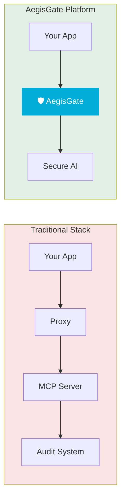
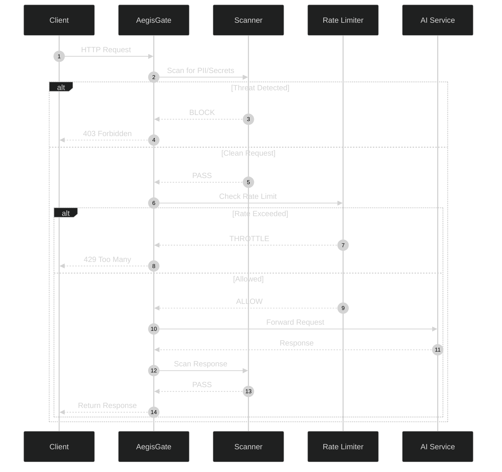
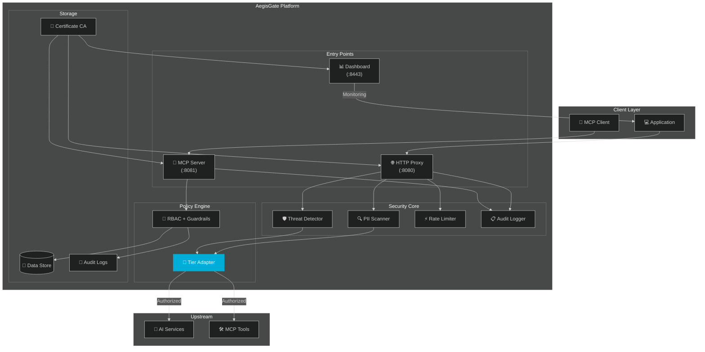
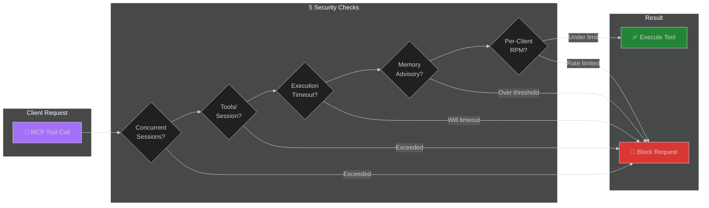
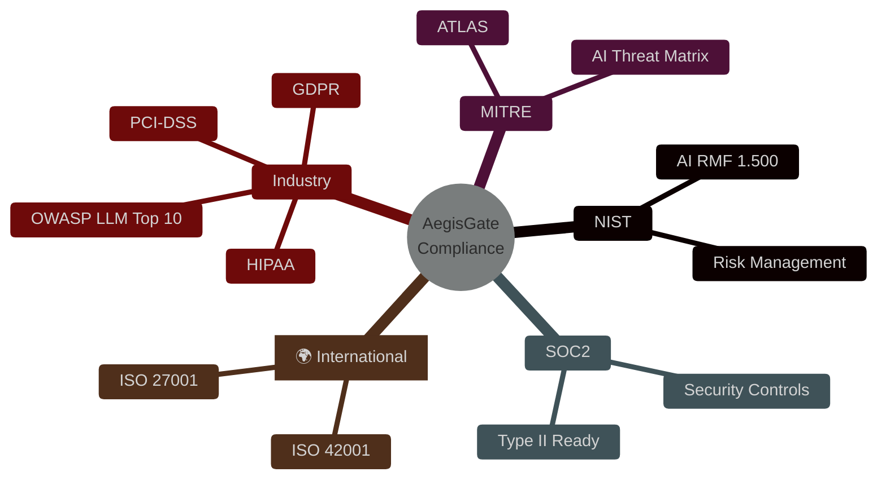

<div align="center">

# 🛡️ AegisGate Platform™ — Enterprise AI Security Gateway

[](https://github.com/aegisgatesecurity/aegisgate-platform/releases)
[](LICENSE)
[](https://golang.org/)
[](SECURITY.md)
[](https://github.com/aegisgatesecurity/aegisgate-platform/actions)

[](Dockerfile)
[](deploy/helm/aegisgate-platform/)
[](PERFORMANCE.md)
[](https://mastodon.social/@aegisgatesecurity)

[📚 Docs](https://github.com/aegisgatesecurity/aegisgate-platform/tree/main/docs) &nbsp;•&nbsp; [✨ Features](#features) &nbsp;•&nbsp; [🚀 Quick Start](#-quick-start) &nbsp;•&nbsp; [🏗️ Architecture](#-architecture) &nbsp;•&nbsp; [⚡ Performance](PERFORMANCE.md) &nbsp;•&nbsp; [🔒 Security](SECURITY.md)

</div>

> **30-Second Pitch**: Your AI applications need enterprise-grade security — but shouldn't require enterprise budgets. AegisGate Platform™ provides unified AI traffic inspection, MCP security guardrails, and compliance automation in a single 19MB binary. Deploy in 60 seconds. Sleep better tonight.

**[v1.3.5 — Compliance Registry Wiring Complete ✅]**(https://github.com/aegisgatesecurity/aegisgate-platform/releases/tag/v1.3.5): Sprint 3 complete — 8+ compliance frameworks tier-aware, ATLAS/NIST mandatory for all, premium frameworks gated by tier.

---

## ⚡ TL;DR

**AegisGate Platform™** is a unified AI security gateway that consolidates HTTP proxy security, MCP protocol protection, and administrative dashboard into a single high-performance binary.

| 🛡️ **Security** | 📋 **Compliance** | 🚀 **Performance** |
|------------------|-------------------|-------------------|
| Real-time threat scanning | **MITRE ATLAS** ✅ Free | **2.44ms avg latency** |
| Prompt injection prevention | **NIST AI RMF** ✅ Free | **11,681 RPS peak** |
| MCP tool authorization | **OWASP LLM Top 10** ✅ Free | **19.1MB Docker image** |
| Data leakage protection | HIPAA, PCI-DSS 🔒 Pro+ | **0 CVEs** |
| RBAC & audit logging | SOC2 Type II, ISO 🔒 Enterprise | **2,350+ tests passing** |

**Zero Configuration Required.** Download, run, secure. MITRE + NIST frameworks always free. Commercial modules licensed. See [Pricing](#-the-strategic-model).

---

## 🎯 What Makes AegisGate Platform Different?

### Traditional Approach vs AegisGate




<details>
<summary>📄 ASCII Diagram Fallback</summary>

```
Traditional Stack:
Your App → Proxy → MCP Server → Audit System   (3 separate configs)

AegisGate:
Your App → [🛡️ AegisGate] → Secure AI          (unified)
```
</details>


**One Binary. One Config. Enterprise-grade Security.**

**[Sprint 3b Complete ✅]**:
- Authentication-by-default (all endpoints require auth unless opted-out)
- MCP server registration logging with client IP tracking
- Hard-enforced memory limits (sessions terminated at quota)
- Tool call limits (20 tools/session enforced)
- Risk-based tool authorization
- 90.8% overall test coverage

---

<!-- Sponsors section — hidden until GitHub Sponsors setup is complete
## 💼 Sponsors

AegisGate is proudly supported by organizations using our platform in production.

> **Become a Sponsor**
> 
| Tier | Monthly | Benefits |
|------|---------|----------|
| 🥇 Gold | $5,000 | Logo on README, priority support, roadmap input |
| 🥈 Silver | $1,000 | Logo in docs, beta access |
| 🥉 Bronze | $500 | Name in sponsors section |

[🤝 Sponsor on GitHub](https://github.com/sponsors/aegisgatesecurity) · [📧 Enterprise Licensing](mailto:sales@aegisgatesecurity.io)
-->

---

## 📊 Request Flow

Every request passes through comprehensive security inspection:




<details>
<summary>📄 ASCII Diagram Fallback</summary>

```
+--------+     +-----------+     +-----------+     +--------------+     +-------------+
| Client |---->| AegisGate |---->|  Scanner  |---->| Rate Limiter |---->| AI Service  |
+--------+     +-----------+     +-----------+     +--------------+     +-------------+
                    |                 |                      |                    |
                    |            [Threat?]            [Quota OK?]          [Execute]
                    |            /      \              /        \
                    |         BLOCK    PASS       THROTTLE    ALLOW
                    |           |       |            |         |
                    +-----------+       +------------+         |
                    403 Forbidden        429 Too Many          +
                                                          Return Response
```
</details>


---

## 🎯 The Strategic Model

**AegisGate Security Platform**: Core security is free; commercial compliance modules are licensed. This aligns with:
- MITRE ATLAS + NIST AI RMF as **foundation** (always free)
- HIPAA, PCI-DSS, SOC2, ISO modules as **commercial tiers**
- ACP/A2A security as the **next frontier**

### Community Tier (Apache 2.0) — Always Free
| Component | Access |
|-----------|--------|
| **MITRE ATLAS Framework** | Full mapping + detection rules |
| **NIST AI RMF 1.500** | Complete implementation |
| **OWASP LLM Top 10** | Protection + reporting |
| **Basic HTTP Proxy** | PII scanning, rate limiting |
| **MCP Server** | Core guardrails (5 base rules) |
| **Self-hosted Dashboard** | Single admin, 7-day retention |

### Commercial Tiers — Licensed
Commercial modules require a paid license. See [NOTICE](NOTICE) for details, or contact [sales@aegisgatesecurity.io](mailto:sales@aegisgatesecurity.io).

| Module | Developer | Professional | Enterprise |
|--------|-----------|--------------|------------|
| **OAuth SSO + OIDC** | ✅ | ✅ | ✅ |
| **HIPAA Compliance** | — | ✅ | ✅ |
| **PCI-DSS** | — | ✅ | ✅ |
| **SOC2 Type II** | — | — | ✅ |
| **ISO 27001** | — | ✅ | ✅ |
| **ISO 42001** | — | — | ✅ |
| **GDPR Advanced** | — | ✅ | ✅ |
| **Multi-tenant Dashboard** | — | ✅ | ✅ |
| **SLA Guarantees** | — | — | ✅ |

### Future: ACP/A2A Agent Security (v2.0)
| Capability | Community | Enterprise |
|------------|-----------|------------|
| Basic agent validation | ✅ | ✅ |
| Cross-agent federation | ❌ | ✅ |
| Agent identity verification | ❌ | ✅ |
| Real-time threat intel | ❌ | ✅ |

**Contact**: [security@aegisgatesecurity.io](mailto:security@aegisgatesecurity.io) · [sales@aegisgatesecurity.io](mailto:sales@aegisgatesecurity.io)

---

## 🔒 Security

Our code security matches our product security:

- **8 security tools** run on every commit
- **0 known CVEs** in production dependencies
- **SARIF reporting** to GitHub Security tab
- **SBOM generation** (CycloneDX + SPDX)
- **Secret scanning** with TruffleHog
- **Vulnerability scanning** with govulncheck + Trivy

See [SECURITY.md](SECURITY.md) for details.

---

## ✅ Sprint 3b — MCP Security Enhancement Complete

**v1.3.5 — released April 2026**

We have addressed critical OpenAI/X security concerns with the following enhancements:

### Authentication-by-Default ✅
- All endpoints require authentication unless explicitly disabled
- Opt-out via `REQUIRE_AUTH=false` environment variable
- Breaking change: users must set opt-out flag to maintain previous behavior

### MCP Server Registration Logging ✅
- Full audit trail with client IP, server ID, and timestamp
- Registration logging via `trackSession()` function
- Configurable via guardrail middleware

### Hard-Enforced Memory Limits ✅
- Sessions automatically terminated when exceeding quota
- In-process memory tracking without cgroups
- Works with Community tier (no elevated privileges needed)

### Tool Call Limits ✅
- 20 tools/session maximum enforced with proper error feedback
- `OnToolCall()` with `incrementToolCount()` atomic operations
- `TestGuardrailHandler_ToolCall` validates 21st call is blocked

### Risk-Based Tool Authorization ✅
- All tool calls checked against authorization matrix
- Risk-based decisions (low/medium/high/critical)
- Default allow if auth matrix not configured

### Test Coverage ✅
- **90.8% overall coverage** across all packages
- **RBAC: 93.9%**, **ToolAuth: 96.2%**, **MCP Server: 88.3%**
- **Zero race conditions** detected
- **2,350+ tests passing** with `-race` detector

### CI/CD Pipeline ✅
- All workflows passing
- gofmt, go vet, race detector clean
- Coverage threshold enforcement at 80%+

---

## 📋 Compliance Coverage

AegisGate Platform™ maps security controls to 9 major compliance frameworks:

| Framework | Coverage | Tier |
|-----------|----------|------|
| **MITRE ATLAS** | All AI-specific attack patterns | Community ✅ |
| **NIST AI RMF** | Complete AI risk management | Community ✅ |
| **OWASP LLM Top 10** | LLM01-LLM10 coverage | Community ✅ |
| **GDPR View** | Detection & data subject rights (view-only) | Community ✅ |
| **Basic Security Controls** | OWASP + basic NIST mapping | Developer 🔒 |
| **HIPAA** | Healthcare data protection, PHI detection, BAA | Professional 🔒 |
| **PCI-DSS** | Payment card security, tokenization | Professional 🔒 |
| **ISO 27001** | Information security management | Professional 🔒 |
| **GDPR Advanced** | Article 30 records, DPIA, breach notification | Professional 🔒 |
| **SOC2 Type II** | Continuous monitoring, evidence collection, auditor reports | Enterprise 🔒 |
| **ISO 42001** | AI management systems | Enterprise 🔒 |
| **FedRAMP** | US federal authorization | Enterprise 🔒 |
| **HITRUST** | Healthcare trust framework | Enterprise 🔒 |

### Testing Metrics
- **90.8% overall coverage** across all packages
- **RBAC: 93.9%**, **ToolAuth: 96.2%**, **MCP Server: 88.3%**
- **Zero race conditions** detected
- **2,350+ tests passing** with `-race` detector

### Performance Metrics
- **Peak Throughput**: 11,681 RPS
- **Average Latency**: 2.44ms
- **P95 Latency**: 3.64ms
- **P99 Latency**: 8.17ms
- **Error Rate**: 0.00%
- **Binary Size**: 14.3MB
- **Docker Image**: 19.1MB

---

## 📦 License & Contribution Model

### Apache License 2.0 — Community Edition

AegisGate Platform™ Community Edition is released under the [Apache License 2.0](LICENSE). This covers the open-source codebase published in this repository.

- ✅ Use the software for any purpose
- ✅ Modify and distribute the software
- ✅ Use in proprietary software
- ✅ Distribute copies to others

**Commercial features** — including enterprise compliance frameworks, advanced threat detection, and priority support — are available under a separate commercial license. See [NOTICE](NOTICE) for trademark and licensing details, or contact [sales@aegisgatesecurity.io](mailto:sales@aegisgatesecurity.io).

### Contribution Model

Contributions are welcome under the [inbound=outbound](https://opensource.microsoft.com/outbound/) model. See [CONTRIBUTING.md](CONTRIBUTING.md) for guidelines. Every commit requires a `Signed-off-by` per our [DCO](DCO.md). No CLA required.

---

## ✨ Features

### Unified Security Gateway

| Component | Port | Purpose |
|-----------|------|---------|
| **HTTP Proxy** | `:8080` | AI API traffic inspection, PII scanning, rate limiting |
| **MCP Server** | `:8081` | Model Context Protocol security, tool authorization |
| **Dashboard** | `:8443` | Real-time monitoring, compliance status, audit logs |

### Security Protection

| Feature | Description | Status |
|---------|-------------|--------|
| **Prompt Injection Prevention** | Blocks OWASP LLM Top 10 attacks | ✅ |
| **Data Leakage Protection** | PII, secrets, credentials detection | ✅ |
| **Adversarial Attack Defense** | Jailbreaks, DoS, manipulation detection | ✅ |
| **MCP Tool Guardrails** | Per-tool authorization policies | ✅ |
| **RBAC Access Control** | Role-based permissions | ✅ |
| **Audit Logging** | RFC5424-compliant, tamper-evident | ✅ |
| **Circuit Breaker** | Automatic failure recovery | ✅ |
| **Auto-Certificate Generation** | Built-in CA, zero-config TLS | ✅ |

### Compliance Frameworks

| Framework | Coverage | Tier |
|-----------|----------|------|
| **MITRE ATLAS** | All AI-specific attack patterns | Community ✅ |
| **NIST AI RMF** | Complete AI risk management | Community ✅ |
| **OWASP LLM Top 10** | LLM01-LLM10 coverage | Community ✅ |
| **GDPR View** | Detection & data subject rights (view-only) | Community ✅ |
| **Basic Security Controls** | OWASP + basic NIST mapping | Developer 🔒 |
| **HIPAA** | Healthcare data protection, PHI detection, BAA | Professional 🔒 |
| **PCI-DSS** | Payment card security, tokenization | Professional 🔒 |
| **ISO 27001** | Information security management | Professional 🔒 |
| **GDPR Advanced** | Article 30 records, DPIA, breach notification | Professional 🔒 |
| **SOC2 Type II** | Continuous monitoring, evidence collection, auditor reports | Enterprise 🔒 |
| **ISO 42001** | AI management systems | Enterprise 🔒 |
| **FedRAMP** | US federal authorization | Enterprise 🔒 |
| **HITRUST** | Healthcare trust framework | Enterprise 🔒 |

---

## 🚀 Quick Start

### Docker (Recommended)

```bash
docker run -d \
  -p 8080:8080 \
  -p 8081:8081 \
  -p 8443:8443 \
  -v $(pwd)/data:/data \
  ghcr.io/aegisgatesecurity/aegisgate-platform:latest \
  --embedded-mcp
```

> **v1.3.5 Update:** Tier is now derived from your license key — no `--tier` flag needed.
> Set `AEGISGATE_LICENSE_KEY` to unlock Developer+ features.
> 
> **Security Note:** Authentication is now enabled by default. Set `REQUIRE_AUTH=false` to opt-out.

### Build from Source

```bash
# Clone the repository
git clone https://github.com/aegisgatesecurity/aegisgate-platform.git
cd aegisgate-platform

# Build and run (Community tier — no license required)
go build -o aegisgate-platform ./cmd/aegisgate-platform
./aegisgate-platform --embedded-mcp

# Run with a license key (Developer+ tiers)
./aegisgate-platform --embedded-mcp --license=YOUR_LICENSE_KEY

# Or set via environment variable
export AEGISGATE_LICENSE_KEY=YOUR_LICENSE_KEY
./aegisgate-platform --embedded-mcp
```

### Verify Installation

```bash
# Health check
curl http://localhost:8443/health

# Check license status
curl http://localhost:8443/api/v1/license/status

# Dashboard (self-signed cert OK)
open https://localhost:8443

# MCP server test
nc -zv localhost 8081
```

---

## 🏗️ Architecture




<details>
<summary>📄 ASCII Diagram Fallback</summary>

```
┌─────────────────────────────────────────────────────────────────────────┐
│                         AEGISGATE PLATFORM                              │
│                          (Single Binary)                                  │
├─────────────────────────────────────────────────────────────────────────┤
│                                                                         │
│  ┌──────────────┐   ┌──────────────┐   ┌──────────────┐                │
│  │  HTTP Proxy  │   │ MCP Server   │   │  Dashboard   │                │
│  │   :8080      │   │   :8081      │   │   :8443      │                │
│  │              │   │              │   │              │                │
│  │ • Scanning   │   │ • Guardrails │   │ • Health     │                │
│  │ • PII detect │   │ • RBAC       │   │ • Metrics    │                │
│  │ • Rate limit │   │ • Audit      │   │ • Compliance │                │
│  └──────┬───────┘   └──────┬───────┘   └──────┬───────┘                │
│         │                   │                  │                        │
│         └───────────────────┼──────────────────┘                        │
│                             │                                           │
│                  ┌──────────┴──────────┐                                │
│                  │   Security Core     │                                │
│                  │ (Scanner/Auth/Logs) │                                │
│                  └──────────┬──────────┘                                │
│                             │                                           │
│  ┌──────────────┐   ┌───────┴────────┐   ┌──────────────┐              │
│  │ Persistence  │   │ Tier Adapter   │   │  Cert Store  │              │
│  │ /data/audit  │   │ (91 Features)  │   │   Auto-CA    │              │
│  └──────────────┘   └───────┬────────┘   └──────────────┘              │
│                             │                                           │
│                    ┌────────┴────────┐                                  │
│                    │ Upstream Services │                                 │
│                    │ (AI APIs, Tools)  │                                 │
│                    └───────────────────┘                                │
│                                                                         │
└─────────────────────────────────────────────────────────────────────────┘
```
</details>


---

## 📊 Performance

**Load tested with k6. See [PERFORMANCE.md](PERFORMANCE.md) for full details.**

| Metric | Result | Grade |
|--------|--------|-------|
| **Peak Throughput** | 11,681 RPS | ✅ Outstanding |
| **Average Latency** | 2.44ms | ✅ Excellent |
| **P95 Latency** | 3.64ms | ✅ Excellent |
| **P99 Latency** | 8.17ms | ✅ Excellent |
| **Error Rate** | 0.00% | ✅ Perfect |
| **Binary Size** | 14.3MB | ✅ Optimized |
| **Docker Image** | 19.1MB | ✅ Minimal |
| **Test Coverage** | 90.8% | ✅ Comprehensive |

**Total Tests: 2,350+ (2,348 PASS, 1 SKIP)**

---

## 🔒 MCP Guardrails

AegisGate implements 5 security guardrails for Model Context Protocol connections:




<details>
<summary>📄 ASCII Diagram Fallback</summary>

```
                        ┌──────────────────┐
                        │ Client Request   │
                        │ 🔌 MCP Tool Call │
                        └────────┬─────────┘
                                 │
            ┌────────────────────┼────────────────────┐
            │              5 GUARDRAILS               │
            │                                         │
            ▼                    ┌──┐                 │
    ┌───────────────┐            │No│                 │
    │ Concurrent    │────Yes────>│  │                 │
    │ Sessions OK?  │            └┬─┘                 │
    └───────────────┘             │                   │
                                  │                   │
            ┌─────────────────────┘                   │
            ▼                    ┌──┐                 │
    ┌───────────────┐            │No│                 │
    │ Tools/Session │────Yes────>│  │                 │
    │ Cap OK?       │            └┬─┘                 │
    └───────────────┘             │                   │
                                  │                   │
            ┌─────────────────────┘                   │
            ▼                    ┌──┐                 │
    ┌───────────────┐            │No│                 │
    │ Execution     │────Yes────>│  │                 │
    │ Timeout OK?   │            └┬─┘                 │
    └───────────────┘             │                   │
                                  │                   │
            ┌─────────────────────┘                   │
            ▼                    ┌──┐                 │
    ┌───────────────┐            │No│                 │
    │ Memory        │────Yes────>│  │                 │
    │ Advisory OK?  │            └┬─┘                 │
    └───────────────┘             │                   │
                                  │                   │
            ┌─────────────────────┘                   │
            ▼                    ┌──┐                 │
    ┌───────────────┐            │No│   ┌────────────┐ │
    │ Per-Client    │────Yes────>│  │──>│ ✅ EXECUTE │ │
    │ RPM OK?       │            └┬─┘   │   TOOL     │ │
    └───────────────┘             │     └────────────┘ │
            │                     │     ┌────────────┐ │
            └─────────────────────┴────>│ 🚫 BLOCK   │ │
                                          │  REQUEST   │ │
                                          └────────────┘ │
                                                       └──┘
```
</details>


### Guardrail Details

| Guardrail | Limit | Default |
|-----------|-------|---------|
| **Concurrent Sessions** | Max simultaneous sessions | 10 per client |
| **Tools per Session** | Max tools available | 50 per session |
| **Execution Timeout** | Max tool execution time | 60 seconds |
| **Memory Advisory** | Memory threshold trigger | 80% utilized |
| **Per-Client RPM** | Max requests per minute | 1,000 per client |

---

## 🛠️ Configuration

### Zero-Config (Just Run)

```bash
aegisgate-platform --embedded-mcp
```

> Tier is derived from your license key. No license = Community tier.

### With License Key

```bash
# Via command-line flag
aegisgate-platform --embedded-mcp --license=YOUR_LICENSE_KEY

# Or via environment variable
export AEGISGATE_LICENSE_KEY=YOUR_LICENSE_KEY
aegisgate-platform --embedded-mcp
```

### With Custom Config

```yaml
# aegisgate-platform.yaml
proxy:
  bind_address: :8080
  upstream_url: https://api.openai.com
  
server:
  port: 8443
  dashboard_port: 8443
  
mcp:
  enabled: true
  port: 8081
  
persistence:
  data_dir: /data
  audit_dir: /data/audit
  enabled: true
  
# No tier key needed — tier is derived from license
# license_key: YOUR_LICENSE_KEY  # Or set AEGISGATE_LICENSE_KEY env var
log_level: info
```

### Environment Variables

```bash
export AEGISGATE_PROXY_BIND_ADDRESS=:8080
export AEGISGATE_DASHBOARD_PORT=8443
export AEGISGATE_LICENSE_KEY=YOUR_LICENSE_KEY
export AEGISGATE_LOG_LEVEL=info
```

---

## 🔄 Integration Examples

### OpenAI Client

```python
import openai

# Point to AegisGate instead of OpenAI directly
openai.api_base = "http://localhost:8080"

response = openai.ChatCompletion.create(
    model="gpt-4",
    messages=[{"role": "user", "content": "Hello, world!"}]
)
```

### MCP Client

```typescript
import { Client } from '@modelcontextprotocol/sdk/client/index.js';

const client = new Client(
  { name: 'my-app', version: '1.0.0' },
  { capabilities: {} }
);

// Connect through AegisGate security layer
await client.connect({
  command: 'node',
  args: ['-e', 'require("net").connect(8081)'],
});
```

---

## 🏛️ Compliance Coverage

AegisGate Platform™ maps security controls to 9 major compliance frameworks:




<details>
<summary>📄 ASCII Diagram Fallback</summary>

```
                    ┌─────────────────────┐
                    │  AegisGate Platform │
                    │    Compliance       │
                    └──────────┬──────────┘
           ┌──────────────────┼──────────────────┐
           │                  │                  │
    ┌──────▼──────┐    ┌──────▼──────┐    ┌──────▼──────┐
    │   NIST      │    │   MITRE     │    │   SOC2      │
    ├─────────────┤    ├─────────────┤    ├─────────────┤
    │ AI RMF      │    │ ATLAS       │    │ Type II     │
    │ 1.500       │    │ AI Threat   │    │ Ready       │
    │             │    │ Matrix      │    │             │
    └─────────────┘    └─────────────┘    └─────────────┘

    ┌────────────────────────────────────────────────┐
    │           INTERNATIONAL STANDARDS                │
    ├────────────────┬──────────────────┬──────────────┤
    │    ISO 27001   │    ISO 42001     │    GDPR      │
    │    Info Sec    │  AI Management   │     EU       │
    └────────────────┴──────────────────┴──────────────┘

    ┌────────────────────────────────────────────────┐
    │              INDUSTRY FRAMEWORKS                 │
    ├──────────────┬──────────────┬──────────────────┤
    │   HIPAA      │   PCI-DSS    │   OWASP          │
    │  Healthcare  │   Payment    │   LLM Top 10     │
    └──────────────┴──────────────┴──────────────────┘

    Total: 9 Compliance Frameworks mapped
```
</details>


**Sprint 3b Complete** ✅ — All critical security controls implemented and production-ready.
**Community Edition includes MITRE ATLAS, NIST AI RMF, OWASP LLM Top 10, and GDPR view-only detection** — commercial tiers unlock HIPAA, PCI-DSS, SOC2 Type II, ISO 27001/42001, and more.

---

## 📚 Documentation

| Document | Description |
|----------|-------------|
| [README.md](README.md) | This file — overview and quick start |
| [PERFORMANCE.md](PERFORMANCE.md) | Load testing results and benchmarks |
| [SECURITY.md](SECURITY.md) | Security policies and vulnerability reporting |
| [CONTRIBUTING.md](CONTRIBUTING.md) | How to contribute |
| [DCO.md](DCO.md) | Developer Certificate of Origin |
| [CODE_OF_CONDUCT.md](CODE_OF_CONDUCT.md) | Community standards |
| [LICENSE](LICENSE) | Apache 2.0 license text |
| [NOTICE](NOTICE) | Trademark reservation and commercial licensing |
| [TRADEMARKS.md](TRADEMARKS.md) | Trademark usage policy |
| [CHANGELOG.md](CHANGELOG.md) | Release history |
| [docs/diagrams/](docs/diagrams/) | Mermaid architecture diagrams |

---

## 🤝 Community

- **Mastodon**: [@aegisgatesecurity](https://mastodon.social/@aegisgatesecurity)
- **GitHub Discussions**: [github.com/aegisgatesecurity/aegisgate-platform/discussions](https://github.com/aegisgatesecurity/aegisgate-platform/discussions)
- **Issues**: [github.com/aegisgatesecurity/aegisgate-platform/issues](https://github.com/aegisgatesecurity/aegisgate-platform/issues)

---

## 📧 Contact

| Purpose | Email |
|---------|-------|
| Sales | sales@aegisgatesecurity.io |
| Security | security@aegisgatesecurity.io |
| Support | support@aegisgatesecurity.io |

---

## 🙏 Acknowledgments

- [MCP Protocol](https://modelcontextprotocol.io) — Model Context Protocol
- [MITRE ATLAS](https://atlas.mitre.org) — AI threat framework
- [NIST AI RMF](https://www.nist.gov/itl/ai-risk-management-framework) — AI risk management
- [OWASP LLM Top 10](https://owasp.org/www-project-top-10-for-large-language-model-applications/) — LLM security

---

<div align="center">

**[aegisgatesecurity.io](https://aegisgatesecurity.io)** — [security@aegisgatesecurity.io](mailto:security@aegisgatesecurity.io)

Built with 🖤 by the AegisGate Security team

© 2024-2026 AegisGate Security, LLC

</div>
