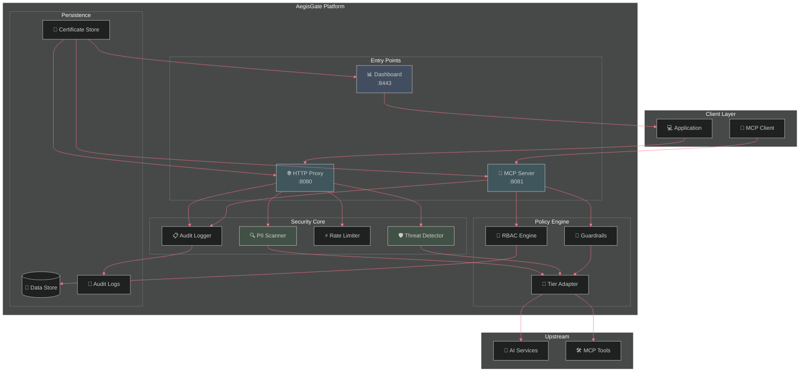
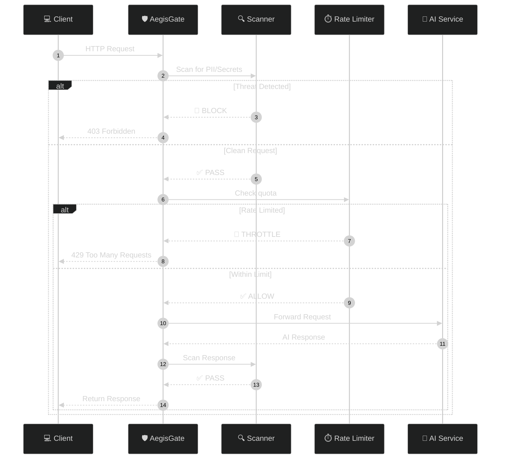

<div align="center">

# 🛡️ AegisGate Platform™ — Secure Every AI Interaction

[](https://github.com/aegisgatesecurity/aegisgate-platform/releases)
[](LICENSE)
[](https://golang.org/)
[](SECURITY.md)
[](https://github.com/aegisgatesecurity/aegisgate-platform/actions)
[](Dockerfile)

[📚 Docs](docs/) • [✨ Features](#features) • [🚀 Quick Start](#quick-start) • [🏗️ Architecture](#architecture) • [🔒 Security](#mcp-security--guardrails) • [📊 Compliance](#compliance-frameworks)

</div>

---

Your AI infrastructure is more than prompts. It's HTTP APIs, MCP agents, RAG pipelines, and third-party LLM integrations—each a potential attack vector.

AegisGate secures **every AI interaction point**: bidirectional API scanning, MCP session isolation, and compliance enforcement.

When [Ox Security called MCP "the mother of all AI supply chain attacks"](https://www.ox.security/blog/the-mother-of-all-ai-supply-chains-critical-systemic-vulnerability-at-the-core-of-the-mcp/), they were right. Their solution: expensive registries and vendor audits. Ours: deployable infrastructure in 60 seconds.

| 🌐 AI API Security | 🔗 MCP Protocol Protection |
|---------------------|---------------------------|
| 144+ detection patterns | Session authentication + isolation |
| Bidirectional request/response scanning | 8 guardrails active |
| Real-time threat blocking | MITRE ATLAS enforcement |
| PII, secrets, API key detection | Tool authorization with risk matrix |

---

## Why AegisGate?

### The Problem
AI agents are connecting to MCP servers you don't control. Every tool call is a potential attack vector:
- **Tool poisoning**: Malicious tools injected into your context
- **Data exfiltration**: Secrets smuggled out via MCP responses
- **Shadow AI**: Developers connecting to unsanctioned endpoints
- **No observability**: You can't see what your agents are doing

### The Solution
```bash
docker run -p 8080:8080 -p 8081:8081 ghcr.io/aegisgatesecurity/aegisgate-platform:latest
```

That's it. One command. Your MCP traffic is now authenticated, inspected, logged, and rate-limited.

---

## 🏗️ Architecture



---

## 🔒 MCP Security & Guardrails

AegisGate implements **8 security guardrails** for every MCP connection:

| Guardrail | Description | Status |
|-----------|-------------|--------|
| **Session Authentication** | Authentication required for all MCP sessions | ✅ |
| **Concurrent Sessions** | Max 10 simultaneous sessions per client | ✅ |
| **Tools per Session** | Max 50 tools available per session | ✅ |
| **STDIO Validation** | Command injection prevention | ✅ |
| **Execution Timeout** | Max 60-second tool execution | ✅ |
| **Memory Monitoring** | Alerts at 80% memory threshold | ✅ |
| **Per-Client RPM** | Max 1,000 requests/minute per client | ✅ |
| **Tool Authorization** | Risk-based tool call approval | ✅ |

### 144+ Pattern Detection

| Category | Patterns | Coverage |
|----------|----------|----------|
| **MITRE ATLAS** | 60+ patterns | Adversarial AI techniques |
| **OWASP LLM Top 10** | 45+ patterns | LLM-specific attacks |
| **HIPAA** | 8 patterns | PHI detection |
| **PCI-DSS** | 6 patterns | Credit card detection |
| **GDPR** | 4 patterns | PII detection |
| **Secret Scanning** | 10+ patterns | API keys, tokens, credentials |

---

## 📊 Compliance Frameworks

AegisGate maps security controls to **13 major compliance frameworks**:

| Framework | Coverage | Tier |
|-----------|----------|------|
| **MITRE ATLAS** | All AI-specific attack patterns | Community ✅ |
| **NIST AI RMF** | Complete AI risk management | Community ✅ |
| **OWASP LLM Top 10** | LLM01-LLM10 coverage | Community ✅ |
| **HIPAA** | Healthcare data protection, PHI detection | Professional 🔒 |
| **PCI-DSS** | Payment card security, tokenization | Professional 🔒 |
| **SOC2 Type II** | Continuous monitoring, evidence collection | Enterprise 🔒 |
| **ISO 27001** | Information security management | Professional 🔒 |
| **ISO 42001** | AI management systems | Enterprise 🔒 |

---

## 🚀 Quick Start

### Docker (Recommended)

```bash
docker run -d \
  -p 8080:8080 \
  -p 8081:8081 \
  -p 8443:8443 \
  -v $(pwd)/data:/data \
  ghcr.io/aegisgatesecurity/aegisgate-platform:latest
```

### Verify Installation

```bash
curl http://localhost:8443/health
```

### With License Key

```bash
export AEGISGATE_LICENSE_KEY=YOUR_LICENSE_KEY
./aegisgate-platform --embedded-mcp
```

---

## Request Flow



---

## ⚡ Performance

| Metric | Result |
|--------|--------|
| **Peak Throughput** | 11,681 RPS |
| **Average Latency** | 2.44ms |
| **P95 Latency** | 3.64ms |
| **Error Rate** | 0.00% |
| **Binary Size** | 19.1MB |
| **Test Coverage** | 82.1% |

*See [PERFORMANCE.md](PERFORMANCE.md) for full load testing details.*

---

## ✨ Features

### Core Security
- **Prompt Injection Prevention** — Blocks OWASP LLM Top 10 attacks
- **Data Leakage Protection** — PII, secrets, credentials detection
- **Adversarial Attack Defense** — Jailbreaks, DoS, manipulation detection
- **RBAC Access Control** — Role-based permissions
- **Audit Logging** — RFC5424-compliant, tamper-evident

### Platform Features
- **Auto-Certificate Generation** — Built-in CA, zero-config TLS
- **Circuit Breaker** — Automatic failure recovery
- **Prometheus Metrics** — Cardinality-controlled monitoring
- **OIDC/SAML SSO** — Enterprise authentication (Developer+)

---

## 🛠️ Configuration

### Zero-Config (Just Run)

```bash
aegisgate-platform --embedded-mcp
```

### Custom Config

```yaml
# aegisgate-platform.yaml
proxy:
  bind_address: :8080
  upstream_url: https://api.openai.com
  
server:
  port: 8443
  
mcp:
  enabled: true
  port: 8081
  
persistence:
  data_dir: /data
  enabled: true
```

---

## 🔄 Integration

### OpenAI Client

```python
import openai
openai.api_base = "http://localhost:8080"

response = openai.ChatCompletion.create(
    model="gpt-4",
    messages=[{"role": "user", "content": "Hello!"}]
)
```

### MCP Client

```typescript
import { Client } from '@modelcontextprotocol/sdk/client/index.js';
const client = new Client({ name: 'my-app', version: '1.0.0' }, { capabilities: {} });
await client.connect({ command: 'node', args: ['server.js'] });
```

---

## 🎯 The Strategic Model

**Core security is free; commercial compliance modules are licensed.**

### Community Tier (Apache 2.0) — Always Free
| Component | Access |
|-----------|--------|
| **MITRE ATLAS Framework** | Full mapping + detection |
| **NIST AI RMF 1.500** | Complete implementation |
| **OWASP LLM Top 10** | Protection + reporting |
| **Basic HTTP Proxy** | PII scanning, rate limiting |
| **MCP Server** | 8 security guardrails |
| **Self-hosted Dashboard** | Single admin, 7-day retention |

### Commercial Tiers
| Module | Developer | Professional | Enterprise |
|--------|-----------|--------------|------------|
| **OAuth SSO (OIDC + SAML)** | ✅ | ✅ | ✅ |
| **HIPAA Compliance** | — | ✅ | ✅ |
| **PCI-DSS** | — | ✅ | ✅ |
| **SOC2 Type II** | — | — | ✅ |
| **Multi-tenant Dashboard** | — | ✅ | ✅ |

**Contact**: [sales@aegisgatesecurity.io](mailto:sales@aegisgatesecurity.io)

---

## 📚 Documentation

| Document | Description |
|----------|-------------|
| [PERFORMANCE.md](PERFORMANCE.md) | Load testing results |
| [SECURITY.md](SECURITY.md) | Security policies |
| [CHANGELOG.md](CHANGELOG.md) | Release history |
| [docs/diagrams/](docs/diagrams/) | Architecture diagrams |

---

## 🔐 Security Disclosure

Email: **security@aegisgatesecurity.io**

| Item | Detail |
|------|--------|
| **Response Time** | 48 hours |
| **Resolution Target** | 90 days |

---

## 🤝 Community

- **Mastodon**: [@aegisgatesecurity](https://mastodon.social/@aegisgatesecurity)
- **GitHub Discussions**: [Discussions](https://github.com/aegisgatesecurity/aegisgate-platform/discussions)
- **Issues**: [Issues](https://github.com/aegisgatesecurity/aegisgate-platform/issues)

---

## ⚠️ Version Notice

| Version | Status |
|---------|--------|
| **v1.3.8** | ✅ **Current** — Supported |
| **v1.3.7** | ✅ Supported |
| **v1.3.6** | ❌ Deprecated |
| < v1.3.5 | ❌ Deprecated |

---

## 🙏 Acknowledgments

- [MCP Protocol](https://modelcontextprotocol.io) — Model Context Protocol
- [MITRE ATLAS](https://atlas.mitre.org) — AI threat framework
- [NIST AI RMF](https://www.nist.gov/itl/ai-risk-management-framework) — AI risk management
- [OWASP LLM Top 10](https://owasp.org/www-project-top-10-for-large-language-model-applications/) — LLM security

---

<div align="center">

**[aegisgatesecurity.io](https://aegisgatesecurity.io)** — [security@aegisgatesecurity.io](mailto:security@aegisgatesecurity.io)

Built with 🖤 by the AegisGate Security team

© 2024-2026 AegisGate Security, LLC

</div>
