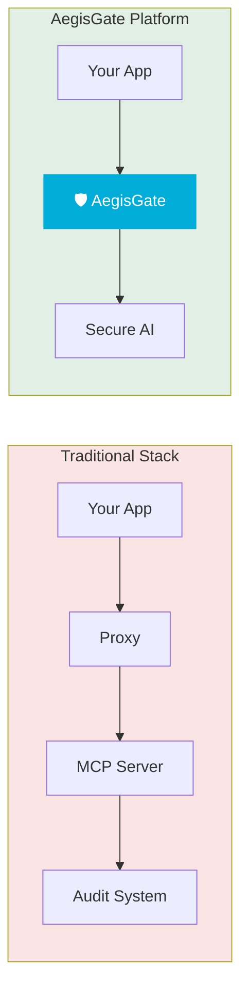
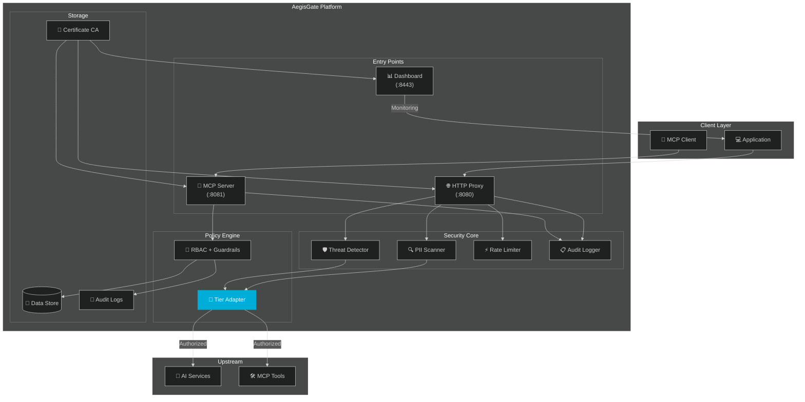

<div align="center">

# 🛡️ AegisGate Platform™ — Enterprise AI Security Gateway

[](https://github.com/aegisgatesecurity/aegisgate-platform/releases)
[](LICENSE)
[](https://golang.org/)
[](SECURITY.md)
[](https://github.com/aegisgatesecurity/aegisgate-platform/actions)

[](Dockerfile)
[](deploy/helm/aegisgate-platform/)
[](PERFORMANCE.md)
[](https://mastodon.social/@aegisgatesecurity)

[📚 Docs](https://github.com/aegisgatesecurity/aegisgate-platform/tree/main/docs) &nbsp;•&nbsp; [✨ Features](#features) &nbsp;•&nbsp; [🚀 Quick Start](#-quick-start) &nbsp;•&nbsp; [🏗️ Architecture](#-architecture) &nbsp;•&nbsp; [⚡ Performance](PERFORMANCE.md) &nbsp;•&nbsp; [🔒 Security](SECURITY.md)

</div>

> **30-Second Pitch**: Your AI applications need enterprise-grade security — but shouldn't require enterprise budgets. AegisGate Platform™ provides unified AI traffic inspection, MCP security guardrails, and compliance automation in a single 19MB binary. Deploy in 60 seconds. Sleep better tonight.

---

## ⚡ TL;DR

**AegisGate Platform™** is a unified AI security gateway that consolidates HTTP proxy security, MCP protocol protection, and administrative dashboard into a single high-performance binary.

| 🛡️ **Security** | 📋 **Compliance** | 🚀 **Performance** |
|-----------------|------------------|-------------------|
| Real-time threat scanning | **MITRE ATLAS** (free) | **2.44ms avg latency** |
| Prompt injection prevention | **NIST AI RMF** (free) | **11,681 RPS peak** |
| MCP tool authorization | SOC2, GDPR, HIPAA | **19.1MB Docker image** |
| Data leakage protection | OWASP LLM Top 10 | **0 CVEs** |
| RBAC & audit logging | ISO 27001/42001 | **2,350+ tests passing** |

**Zero Configuration Required.** Download, run, secure. No external dependencies. No paid services. Ever.

---

## 🎯 What Makes AegisGate Platform Different?

### Traditional Approach vs AegisGate




---

## 🔒 Security

Our code security matches our product security:

- **8 security tools** run on every commit
- **0 known CVEs** in production dependencies
- **SARIF reporting** to GitHub Security tab
- **SBOM generation** (CycloneDX + SPDX)
- **Secret scanning** with TruffleHog
- **Vulnerability scanning** with govulncheck + Trivy

See [SECURITY.md](SECURITY.md) for details.

---

## 📦 License & Contribution Model

### Apache License 2.0 — Community Edition

AegisGate Platform™ Community Edition is released under the [Apache License 2.0](LICENSE). This covers the open-source codebase published in this repository.

- ✅ Use the software for any purpose
- ✅ Modify and distribute the software
- ✅ Use in proprietary software
- ✅ Distribute copies to others

**Commercial features** — including enterprise compliance frameworks, advanced threat detection, and priority support — are available under a separate commercial license. See [NOTICE](NOTICE) for trademark and licensing details, or contact [sales@aegisgatesecurity.io](mailto:sales@aegisgatesecurity.io).

### Contribution Model

Contributions are welcome under the [inbound=outbound](https://opensource.microsoft.com/outbound/) model. See [CONTRIBUTING.md](CONTRIBUTING.md) for guidelines. Every commit requires a `Signed-off-by` per our [DCO](DCO.md). No CLA required.

---

## ✨ Features

### Unified Security Gateway

| Component | Port | Purpose |
|-----------|------|---------|
| **HTTP Proxy** | `:8080` | AI API traffic inspection, PII scanning, rate limiting |
| **MCP Server** | `:8081` | Model Context Protocol security, tool authorization |
| **Dashboard** | `:8443` | Real-time monitoring, compliance status, audit logs |

### Security Protection

| Feature | Description | Status |
|---------|-------------|--------|
| **Prompt Injection Prevention** | Blocks OWASP LLM Top 10 attacks | ✅ |
| **Data Leakage Protection** | PII, secrets, credentials detection | ✅ |
| **Adversarial Attack Defense** | Jailbreaks, DoS, manipulation detection | ✅ |
| **MCP Tool Guardrails** | Per-tool authorization policies | ✅ |
| **RBAC Access Control** | Role-based permissions | ✅ |
| **Audit Logging** | RFC5424-compliant, tamper-evident | ✅ |
| **Circuit Breaker** | Automatic failure recovery | ✅ |
| **Auto-Certificate Generation** | Built-in CA, zero-config TLS | ✅ |

### Compliance Frameworks (Community Tier)

| Framework | Coverage | Availability |
|-----------|----------|--------------|
| **MITRE ATLAS** | All AI-specific attack patterns | ✅ |
| **NIST AI RMF** | Complete AI risk management | ✅ |
| **OWASP LLM Top 10** | LLM01-LLM10 coverage | ✅ |
| **SOC 2** | Security controls | ✅ |
| **HIPAA** | Healthcare data protection | ✅ |
| **GDPR** | EU data protection | ✅ |
| **ISO 27001** | Information security | ✅ |
| **ISO 42001** | AI management systems | ✅ |
| **PCI-DSS** | Payment card security | ✅ |

---

## 🚀 Quick Start

### Docker (Recommended)

```bash
docker run -d \
  -p 8080:8080 \
  -p 8081:8081 \
  -p 8443:8443 \
  -v $(pwd)/data:/data \
  ghcr.io/aegisgatesecurity/aegisgate-platform/aegisgate:latest \
  --embedded-mcp --tier=community
```

### Build from Source

```bash
# Clone the repository
git clone https://github.com/aegisgatesecurity/aegisgate-platform.git
cd aegisgate-platform

# Build and run
go build -o aegisgate-platform ./cmd/aegisgate-platform
./aegisgate-platform --embedded-mcp --tier=community
```

### Verify Installation

```bash
# Health check
curl http://localhost:8443/health

# Dashboard (self-signed cert OK)
open https://localhost:8443

# MCP server test
nc -zv localhost 8081
```

---

## 🏗️ Architecture




**Community Edition includes all frameworks** — no hidden enterprise tiers.

---

## 📚 Documentation

| Document | Description |
|----------|-------------|
| [README.md](README.md) | This file — overview and quick start |
| [PERFORMANCE.md](PERFORMANCE.md) | Load testing results and benchmarks |
| [SECURITY.md](SECURITY.md) | Security policies and vulnerability reporting |
| [CONTRIBUTING.md](CONTRIBUTING.md) | How to contribute |
| [DCO.md](DCO.md) | Developer Certificate of Origin |
| [CODE_OF_CONDUCT.md](CODE_OF_CONDUCT.md) | Community standards |
| [LICENSE](LICENSE) | Apache 2.0 license text |
| [NOTICE](NOTICE) | Trademark reservation and commercial licensing |
| [TRADEMARKS.md](TRADEMARKS.md) | Trademark usage policy |
| [CHANGELOG.md](CHANGELOG.md) | Release history |
| [docs/diagrams/](docs/diagrams/) | Mermaid architecture diagrams |

---

## 🤝 Community

- **Mastodon**: [@aegisgatesecurity](https://mastodon.social/@aegisgatesecurity)
- **GitHub Discussions**: [github.com/aegisgatesecurity/aegisgate-platform/discussions](https://github.com/aegisgatesecurity/aegisgate-platform/discussions)
- **Issues**: [github.com/aegisgatesecurity/aegisgate-platform/issues](https://github.com/aegisgatesecurity/aegisgate-platform/issues)

---

## 📧 Contact

| Purpose | Email |
|---------|-------|
| Sales | sales@aegisgatesecurity.io |
| Security | security@aegisgatesecurity.io |
| Support | support@aegisgatesecurity.io |

---

## 🙏 Acknowledgments

- [MCP Protocol](https://modelcontextprotocol.io) — Model Context Protocol
- [MITRE ATLAS](https://atlas.mitre.org) — AI threat framework
- [NIST AI RMF](https://www.nist.gov/itl/ai-risk-management-framework) — AI risk management
- [OWASP LLM Top 10](https://owasp.org/www-project-top-10-for-large-language-model-applications/) — LLM security

---

<div align="center">

**[aegisgatesecurity.io](https://aegisgatesecurity.io)**

Built with 🖤 by the AegisGate Security team

© 2024-2026 AegisGate Security, LLC

</div>
