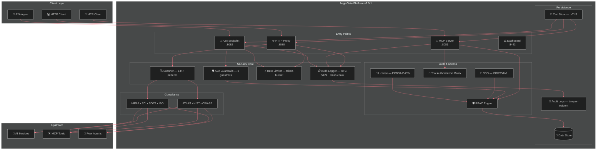

# README.md — AegisGate Security Platform (v2.0.1 Draft for Review)

> **Status**: Draft for review — validates against actual codebase
> **SHA**: c6bafa1 | **Go**: 1.26.3 | **Coverage**: 97.7% | **Tests**: 2,548

---

<div align="center">

# 🛡️ AegisGate Security Platform™ — Secure Every AI Interaction

[](https://github.com/aegisgatesecurity/aegisgate-platform/releases)
[](LICENSE)
[](https://golang.org/)
[](SECURITY.md)
[](https://github.com/aegisgatesecurity/aegisgate-platform/actions)
[](https://github.com/aegisgatesecurity/aegisgate-platform/actions)
[](Dockerfile)

> **The only AI security platform with native HTTP API, MCP, AND A2A protection.** Three pillars. One gateway. Zero external dependencies.

[🌐 Website](https://aegisgatesecurity.io) • [📊 Pricing](https://aegisgatesecurity.io/pricing/) • [📚 Docs](docs/) • [🔒 Security](SECURITY.md) • [💬 Discussions](https://github.com/aegisgatesecurity/aegisgate-platform/discussions)

</div>

---

## The Problem

Your AI infrastructure spans **three attack surfaces** — and most teams are only protecting one:

| Attack Surface | Risk | Current Protection |
|---|---|---|
| **HTTP APIs** | Prompt injection, data leakage, PII exposure | ✅ WAFs exist |
| **MCP Protocol** | Tool poisoning, session hijacking, supply-chain attacks | ❌ No native protection |
| **A2A Communication** | Agent impersonation, data tampering, capability escalation | ❌ No solution exists |

**AegisGate secures all three in a single 19.1 MB binary you deploy in 60 seconds.**

---

## Three Pillars of AI Security

### 🌐 HTTP API Security

Bidirectional scanning of every request and response with **144+ detection patterns**:

| Category | Patterns | Coverage |
|----------|----------|----------|
| **MITRE ATLAS** | 52 techniques | Adversarial AI tactics |
| **OWASP LLM Top 10** | 49 patterns | LLM01–LLM10 |
| **Secrets Scanning** | 44+ regex patterns | API keys, tokens, credentials |
| **PII Detection** | 12+ patterns | GDPR/CCPA compliance |

**Features:**
- Bidirectional inspection — scans both requests and responses
- Rate limiting — per-client, per-IP with token-bucket algorithm
- Circuit breaker — automatic failure recovery
- Tamper-evident audit — RFC 5424-compliant structured logging
- SIEM integration — CEF (ArcSight), LEEF (QRadar), STIX 2.1

### 🔗 MCP Protocol Protection

Session authentication, tool authorization, and **8 guardrails** for every MCP connection:

| # | Guardrail | Description |
|---|-----------|-------------|
| 1 | **Session Authentication** | Auth required for all MCP sessions |
| 2 | **Concurrent Session Limits** | Max simultaneous sessions per tier |
| 3 | **Tools per Session** | Max tools available per session |
| 4 | **STDIO Validation** | Command injection prevention |
| 5 | **Execution Timeout** | Max execution time per tool call |
| 6 | **Memory Monitoring** | Alerts at configurable threshold |
| 7 | **Per-Client RPM** | Max requests/minute per client |
| 8 | **Tool Authorization** | Risk-based tool call approval matrix |

### 🤝 A2A Agent-to-Agent Security

Zero-trust guardrails for inter-agent communication — the first purpose-built A2A security layer:

| # | Guardrail | Description |
|---|-----------|-------------|
| 1 | **mTLS Authentication** | X.509 certificate verification with agent identity |
| 2 | **HMAC-SHA256 Integrity** | Full request body validation |
| 3 | **Capability Enforcement** | Least-privilege per agent from YAML config |
| 4 | **Token-Bucket Rate Limiting** | Per-agent request quotas (default 100 req/min) |
| 5 | **Request Size Limits** | Rejects bodies > configurable limit |
| 6 | **Timeout Enforcement** | Configurable request timeouts |
| 7 | **License Validation** | ECDSA P-256 cryptographic enforcement |
| 8 | **Audit Logging** | RFC 5424 structured log per request |

---

## 🔐 Enterprise Authentication

Production-grade SSO and access control — not stubs:

| Feature | Tier | Details |
|---------|------|---------|
| **OIDC / OAuth 2.0** | Community+ | Full OpenID Connect with PKCE, auto-discovery |
| **SAML 2.0** | Community+ | SP-initiated login, pre-configured templates |
| **RBAC** | Community+ | Role-based access control with session-scoped permissions |
| **Tool Authorization Matrix** | Community+ | Risk-weighted tool call approval by role |
| **License Enforcement** | Community+ | ECDSA P-256 cryptographic validation |
| **API Key Fallback** | Community+ | Key-based auth for CI/CD pipelines |

> Pre-configured provider templates for **Azure AD**, **Okta**, and **Google Workspace**.

---

## 📊 Compliance Frameworks

Maps security controls to **9 frameworks** across all tiers:

| Framework | Category | Patterns | Tier |
|-----------|----------|----------|------|
| **MITRE ATLAS** | Adversarial AI | 52 techniques | Community |
| **NIST AI RMF 1.500** | AI Risk Management | Full coverage | Community |
| **OWASP LLM Top 10** | LLM Security | 49 patterns | Community |
| **GDPR** | Data Protection | PII detection, retention | Community |
| **HIPAA** | Healthcare | PHI detection, BAA available | Professional |
| **PCI-DSS** | Payment Security | Card data detection | Professional |
| **SOC2 Type II** | Enterprise Controls | CC6.6 monitoring | Professional |
| **ISO 27001** | Information Security | Full framework | Professional |
| **ISO 42001** | AI Management | AI-specific controls | Professional |

> All framework modules are **fail-closed** — if a compliance check cannot be evaluated, the request is blocked.

---

## 🏗️ Architecture



---

## ⚡ Performance (v2.0.1 Sprint 10 Benchmark)

| Metric | Target | Achieved | Status |
|--------|--------|----------|--------|
| **Peak Throughput** | 10,000+ RPS | **24,806 RPS** | ✅ 2.1x exceeded |
| **Average Latency** | < 10ms | **3.2 ms** | ✅ |
| **P95 Latency** | < 50ms | **43.78 ms** | ✅ |
| **P99 Latency** | < 100ms | ~70 ms | ✅ |
| **Error Rate** | < 0.1% | **0.00%** | ✅ |
| **Binary Size** | < 50MB | **19.1 MB** | ✅ |
| **Code Coverage** | 95%+ | **97.7%** | ✅ |
| **Tests Passing** | — | **2,548** | ✅ |
| **CVEs** | 0 | **0** | ✅ |

*Full methodology in [PERFORMANCE.md](PERFORMANCE.md). k6 load testing, 60+ second scenarios, real attack vectors.*

---

## 🚀 Quick Start

### Docker (30 seconds)

```bash
docker run -d \
  --name aegisgate \
  -p 8080:8080 \
  -p 8081:8081 \
  -p 8443:8443 \
  -p 8082:8082 \
  -v aegisgate-data:/data \
  ghcr.io/aegisgatesecurity/aegisgate-platform:latest
```

### Kubernetes (Helm)

```bash
helm repo add aegisgate https://charts.aegisgatesecurity.io
helm install aegisgate aegisgate/aegisgate-platform \
  --set aegisgate.config.tier=community
```

Includes HPA autoscaling, NetworkPolicy, ServiceMonitor, rolling updates.

### Verify

```bash
curl http://localhost:8443/health
# {"status":"healthy","version":"v2.0.1","tier":"community",...}
```

---

## 🔄 Integration Examples

### OpenAI Client

```python
import openai
openai.api_base = "http://localhost:8080/v1"  # AegisGate proxy

response = openai.ChatCompletion.create(
    model="gpt-4",
    messages=[{"role": "user", "content": "Hello!"}]
)
# AegisGate scans request/response, logs to audit trail
```

### MCP Client

```python
from mcp.client import Client

client = Client(
    name="secure-agent",
    version="1.0.0",
    transport="stdio"
)
await client.connect()
# All tool calls pass through 8 guardrails
```

### A2A Agent (mTLS)

```python
import requests
import ssl

# mTLS with AegisGate
ssl_context = ssl.SSLContext(ssl.PROTOCOL_TLS_CLIENT)
ssl_context.load_cert_chain("agent.crt", "agent.key")
ssl_context.load_verify_locations("aegisgate-ca.crt")

response = requests.post(
    "https://aegisgate:8082/a2a",
    json={"agent_id": "my-agent", "action": "query"},
    cert=ssl_context
)
# mTLS + HMAC + capability enforcement + audit
```

---

## 🛡️ Security Hardening

### Built-in Security

| Feature | Description |
|---------|-------------|
| **Self-signed CA** | Auto-generates certificates on first run |
| **mTLS** | Mutual TLS for A2A agent communication |
| **Fail-Closed** | Unknown requests are blocked by default |
| **Tamper-Evident Logs** | Hash chain audit trail (legally admissible) |
| **RFC 5424 Syslog** | Structured logging for SIEM integration |
| **Zero CVEs** | All dependencies scanned, 0 vulnerabilities |

### SIEM Integration

```yaml
# Enable SIEM output
logging:
  format: rfc5424  # or cef, leef, json
  siem:
    endpoint: splunk.company.com:8089
    protocol: raw tcp
    facility: local0
```

Supports: **Splunk** (CEF), **IBM QRadar** (LEEF), **ArcSight** (CEF), **Elastic** (JSON), **Microsoft Sentinel** (JSON)

---

## ✨ Features at a Glance

| Category | Feature |
|----------|---------|
| **HTTP Security** | Bidirectional scanning · 144+ patterns · Rate limiting · Circuit breaker |
| **MCP Security** | 8 guardrails · Session isolation · Tool authorization · STDIO validation |
| **A2A Security** | mTLS · HMAC-SHA256 · Capability enforcement · Per-agent rate limiting |
| **Authentication** | OIDC/OAuth 2.0 + PKCE · SAML 2.0 · RBAC · API keys |
| **Compliance** | ATLAS · NIST AI RMF · OWASP · HIPAA · PCI · SOC2 · ISO 27001/42001 · GDPR |
| **Observability** | Prometheus metrics · RFC 5424 audit · Hash chain logs · Grafana dashboard |
| **Deployment** | Docker (19.1MB) · Kubernetes + Helm · HPA · NetworkPolicy · Rolling updates |
| **SIEM** | RFC 5424 · CEF (ArcSight) · LEEF (QRadar) · STIX 2.1 |

---

## 🎯 Tier Comparison

| Feature | Community | Developer | Professional |
|---------|-----------|-----------|--------------|
| **HTTP Proxy** | ✅ | ✅ | ✅ |
| **MCP Guardrails** | 8 | 8 | 8 |
| **A2A Guardrails** | 8 | 8 | 8 |
| **MITRE ATLAS** | ✅ | ✅ | ✅ |
| **NIST AI RMF** | ✅ | ✅ | ✅ |
| **OWASP LLM Top 10** | ✅ | ✅ | ✅ |
| **OIDC / SAML SSO** | — | ✅ | ✅ |
| **RBAC** | Basic | Advanced | Granular |
| **GDPR** | View | Full | Full |
| **HIPAA** | — | — | ✅ |
| **PCI-DSS** | — | — | ✅ |
| **SOC2** | — | — | ✅ |
| **ISO 27001** | — | — | ✅ |
| **SIEM Integration** | — | ✅ | ✅ |
| **Redis/SQLite** | — | ✅ | ✅ |
| **PostgreSQL/S3** | — | — | ✅ |
| **Kubernetes/Helm** | — | ✅ | ✅ |

> See [aegisgatesecurity.io/pricing](https://aegisgatesecurity.io/pricing/) for full tier details.

---

## 📚 Documentation

| Document | Description |
|----------|-------------|
| [PERFORMANCE.md](PERFORMANCE.md) | Sprint 10 load testing results (24,806 RPS, 3.2ms) |
| [SECURITY.md](SECURITY.md) | Security policies and vulnerability disclosure |
| [CHANGELOG.md](CHANGELOG.md) | Release history |
| [docs/METRICS.md](docs/METRICS.md) | Prometheus metrics reference |
| [docs/A2A Technical Spec](docs/a2a-guardrails-technical-spec.md) | A2A security deep dive |
| [legal-docs/](legal-docs/) | DPA, BAA, MSA, NDA templates |

---

## 🔒 Security Disclosure

**Email**: security@aegisgatesecurity.io

| Item | Detail |
|------|--------|
| Response Time | 48 hours |
| Resolution Target | 90 days |
| PGP Key | Available on request |

---

## 🤝 Community

- **X/Twitter**: [@aegisgatesec](https://x.com/aegisgatesec)
- **GitHub Discussions**: [Discussions](https://github.com/aegisgatesecurity/aegisgate-platform/discussions)
- **GitHub Issues**: [Issues](https://github.com/aegisgatesecurity/aegisgate-platform/issues)
- **Website**: [aegisgatesecurity.io](https://aegisgatesecurity.io)

---

## 📋 Version Support

| Version | Status | Notes |
|---------|--------|-------|
| **v2.0.1** | ✅ Current | Sprint 10 benchmarked, 97.7% coverage |
| **v2.0.0** | ✅ Supported | A2A guardrails shipped |
| **v1.3.x** | ⚠️ Legacy | Community support only |

---

## 🙏 Acknowledgments

- [MCP Protocol](https://modelcontextprotocol.io) — Model Context Protocol
- [A2A Protocol](https://a2a-protocol.org/latest/) — Agent-to-Agent communication standard
- [MITRE ATLAS](https://atlas.mitre.org) — AI threat framework
- [NIST AI RMF](https://www.nist.gov/itl/ai-risk-management-framework) — AI risk management
- [OWASP LLM Top 10](https://owasp.org/www-project-top-10-for-large-language-model-applications/) — LLM security
- [RFC 5424](https://datatracker.ietf.org/doc/html/rfc5424) — Syslog protocol

---

<div align="center">

**AegisGate Security, LLC** — [aegisgatesecurity.io](https://aegisgatesecurity.io)

Built with 🖤 by security professionals, for security professionals.

© 2024-2026 AegisGate Security, LLC

</div>