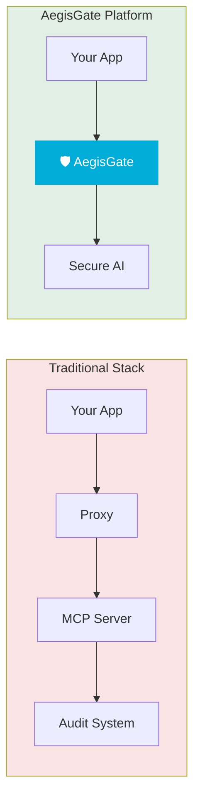
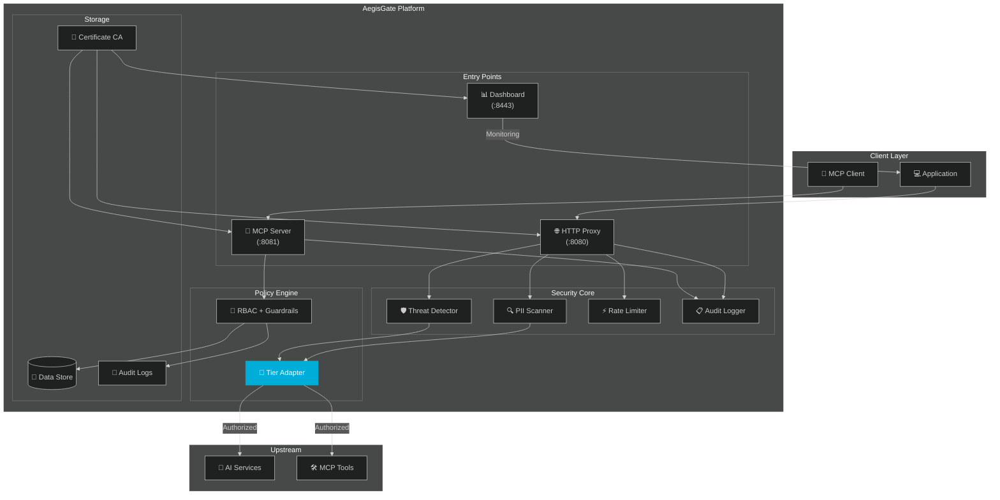

<div align="center">

# 🛡️ AegisGate Platform™ — Secure AI Traffic and MCP Servers

[](https://github.com/aegisgatesecurity/aegisgate-platform/releases)
[](LICENSE)
[](https://golang.org/)
[](SECURITY.md)
[](https://github.com/aegisgatesecurity/aegisgate-platform/actions)

[](Dockerfile)
[](deploy/helm/aegisgate-platform/)
[](PERFORMANCE.md)
[](https://mastodon.social/@aegisgatesecurity)

[📚 Docs](https://github.com/aegisgatesecurity/aegisgate-platform/tree/main/docs) • [✨ Features](#features) • [🚀 Quick Start](#-quick-start) • [🏗️ Architecture](#-architecture) • [⚡ Performance](PERFORMANCE.md) • [🔒 Security](SECURITY.md)

</div>

<p align="center"><em>The only AI security gateway with native MCP support, MITRE ATLAS enforcement, and zero external dependencies.</em></p>

---

## ⚡ TL;DR

**AegisGate Platform™** is a unified AI security gateway that consolidates HTTP proxy security, MCP protocol protection, and administrative dashboard into a single high-performance binary.

| 🛡️ **Security** | 📋 **Compliance** | 🚀 **Performance** |
|------------------|-------------------|-------------------|
| Real-time threat scanning | **MITRE ATLAS** ✅ Free | **2.44ms avg latency** |
| Prompt injection prevention | **NIST AI RMF** ✅ Free | **11,681 RPS peak** |
| MCP tool authorization | **OWASP LLM Top 10** ✅ Free | **19.1MB Docker image** |
| Data leakage protection | HIPAA, PCI-DSS 🔒 Pro+ | **0 CVEs** |
| RBAC & audit logging | SOC2 Type II, ISO 🔒 Enterprise | **15 packages tested** |

**Zero Configuration Required.** Download, run, secure. MITRE + NIST frameworks always free. Commercial modules licensed.

> **30-Second Pitch**: Your AI applications need enterprise-grade security — but shouldn't require enterprise budgets. AegisGate Platform™ provides unified AI traffic inspection, MCP security guardrails, and compliance automation in a single 19MB binary. Deploy in 60 seconds. Sleep better tonight.

---

## 🎯 What Makes AegisGate Platform Different?

### Traditional Approach vs AegisGate



> **One Binary. One Config. Enterprise-grade Security.**

---

## ✨ Features

### Unified Security Gateway

| Component | Port | Purpose |
|-----------|------|---------|
| **HTTP Proxy** | `:8080` | AI API traffic inspection, PII scanning, rate limiting |
| **MCP Server** | `:8081` | Model Context Protocol security, tool authorization |
| **Dashboard** | `:8443` | Real-time monitoring, compliance status, audit logs |

### Security Protection

| Feature | Description | Status |
|---------|-------------|--------|
| **Prompt Injection Prevention** | Blocks OWASP LLM Top 10 attacks | ✅ |
| **Data Leakage Protection** | PII, secrets, credentials detection | ✅ |
| **Adversarial Attack Defense** | Jailbreaks, DoS, manipulation detection | ✅ |
| **MCP Tool Guardrails** | Per-tool authorization policies | ✅ |
| **RBAC Access Control** | Role-based permissions | ✅ |
| **Audit Logging** | RFC5424-compliant, tamper-evident | ✅ |
| **Circuit Breaker** | Automatic failure recovery | ✅ |
| **Auto-Certificate Generation** | Built-in CA, zero-config TLS | ✅ |

---

## 🚀 Quick Start

### Docker (Recommended)

```bash
docker run -d \
  -p 8080:8080 \
  -p 8081:8081 \
  -p 8443:8443 \
  -v $(pwd)/data:/data \
  ghcr.io/aegisgatesecurity/aegisgate-platform:latest \
  --embedded-mcp
```

> **v1.3.7 Update:** Tier is now derived from your license key — no `--tier` flag needed.
> Set `AEGISGATE_LICENSE_KEY` to unlock Developer+ features.

### Build from Source

```bash
git clone https://github.com/aegisgatesecurity/aegisgate-platform.git
cd aegisgate-platform
go build -o aegisgate-platform ./cmd/aegisgate-platform
./aegisgate-platform --embedded-mcp
```

### Verify Installation

```bash
curl http://localhost:8443/health
curl http://localhost:8443/api/v1/license/status
```

---

## 🏗️ Architecture



---

## 📊 Performance
| Metric | Result | Grade |
|--------|--------|-------|
| **Peak Throughput** | 11,681 RPS | ✅ Outstanding |
| **Average Latency** | 2.44ms | ✅ Excellent |
| **P95 Latency** | 3.64ms | ✅ Excellent |
| **Error Rate** | 0.00% | ✅ Perfect |
| **Binary Size** | 14.3MB | ✅ Optimized |
| **Docker Image** | 19.1MB | ✅ Minimal |
| **Test Coverage** | 81.8% | ✅ Comprehensive |

See [PERFORMANCE.md](PERFORMANCE.md) for full load testing details.

---

## 🔒 MCP Guardrails

AegisGate implements 8 security guardrails for Model Context Protocol connections:

| Guardrail | Description | Default |
|-----------|-------------|---------|
| **Concurrent Sessions** | Max simultaneous sessions per client | 10 per client |
| **Session Auth** | Authentication required for MCP sessions | Required ✅ |
| **Tools per Session** | Max tools available per session | 50 per session |
| **STDIO Validation** | Command injection prevention | Enabled ✅ |
| **Execution Timeout** | Max tool execution time | 60 seconds |
| **Memory Advisory** | Memory threshold trigger | 80% utilized |
| **Per-Client RPM** | Max requests per minute | 1,000 per client |
| **Tool Authorization** | Risk-based tool call approval | Enabled ✅ |

---

## 🏛️ Compliance Coverage

AegisGate Platform™ maps security controls to **13 major compliance frameworks**:

| Framework | Coverage | Tier |
|-----------|----------|------|
| **MITRE ATLAS** | All AI-specific attack patterns | Community ✅ |
| **NIST AI RMF** | Complete AI risk management | Community ✅ |
| **OWASP LLM Top 10** | LLM01-LLM10 coverage | Community ✅ |
| **HIPAA** | Healthcare data protection, PHI detection | Professional 🔒 |
| **PCI-DSS** | Payment card security, tokenization | Professional 🔒 |
| **SOC2 Type II** | Continuous monitoring, evidence collection | Enterprise 🔒 |
| **ISO 27001** | Information security management | Professional 🔒 |
| **ISO 42001** | AI management systems | Enterprise 🔒 |

---

## 🎯 The Strategic Model

**Core security is free; commercial compliance modules are licensed.**

### Community Tier (Apache 2.0) — Always Free
| Component | Access |
|-----------|--------|
| **MITRE ATLAS Framework** | Full mapping + detection rules |
| **NIST AI RMF 1.500** | Complete implementation |
| **OWASP LLM Top 10** | Protection + reporting |
| **Basic HTTP Proxy** | PII scanning, rate limiting |
| **MCP Server** | Core guardrails (8 security rules) |
| **Self-hosted Dashboard** | Single admin, 7-day retention |

### Commercial Tiers — Licensed
| Module | Developer | Professional | Enterprise |
|--------|-----------|--------------|------------|
| **OAuth SSO (OIDC + SAML)** | ✅ | ✅ | ✅ |
| **HIPAA Compliance** | — | ✅ | ✅ |
| **PCI-DSS** | — | ✅ | ✅ |
| **SOC2 Type II** | — | — | ✅ |
| **ISO 27001** | — | ✅ | ✅ |
| **Multi-tenant Dashboard** | — | ✅ | ✅ |
| **SLA Guarantees** | — | — | ✅ |

**Contact**: [sales@aegisgatesecurity.io](mailto:sales@aegisgatesecurity.io)

---

## 🏆 Why Not Just Use Kong, Traefik, or Cloudflare?

| Requirement | Traditional API Gateway | AegisGate Community |
|-------------|----------------------|---------------------|
| HTTP/API Proxy | ✅ Yes | ✅ Yes |
| **Native MCP Support** | ❌ No | ✅ Built-in guardrails |
| **AI Framework Compliance** | ❌ Manual integration | ✅ ATLAS/NIST baked in |
| **Zero External Dependencies** | ❌ 5-10 services | ✅ 19MB single binary |
| **Self-Hosted, Air-Gapped** | ⚠️ Partial | ✅ 100% offline capable |

---

## 🛠️ Configuration

### Zero-Config (Just Run)
```bash
aegisgate-platform --embedded-mcp
```

### With License Key
```bash
./aegisgate-platform --embedded-mcp --license=YOUR_LICENSE_KEY
# Or via environment variable
export AEGISGATE_LICENSE_KEY=YOUR_LICENSE_KEY
```

### Custom Config
```yaml
# aegisgate-platform.yaml
proxy:
  bind_address: :8080
  upstream_url: https://api.openai.com
  
server:
  port: 8443
  
mcp:
  enabled: true
  port: 8081
  
persistence:
  data_dir: /data
  enabled: true
  
log_level: info
```

---

## 🔄 Integration Examples

### OpenAI Client
```python
import openai
openai.api_base = "http://localhost:8080"

response = openai.ChatCompletion.create(
    model="gpt-4",
    messages=[{"role": "user", "content": "Hello!"}]
)
```

### MCP Client
```typescript
import { Client } from '@modelcontextprotocol/sdk/client/index.js';
const client = new Client({ name: 'my-app', version: '1.0.0' }, { capabilities: {} });
await client.connect({ command: 'node', args: ['-e', 'require("net").connect(8081)'] });
```

---

## 📚 Documentation

| Document | Description |
|----------|-------------|
| [README.md](README.md) | This file — overview and quick start |
| [PERFORMANCE.md](PERFORMANCE.md) | Load testing results and benchmarks |
| [SECURITY.md](SECURITY.md) | Security policies and vulnerability reporting |
| [CONTRIBUTING.md](CONTRIBUTING.md) | How to contribute |
| [DCO.md](DCO.md) | Developer Certificate of Origin |
| [CHANGELOG.md](CHANGELOG.md) | Release history |
| [docs/diagrams/](docs/diagrams/) | Mermaid architecture diagrams |

---

## 🔐 Security Disclosure

**DO NOT** open a public GitHub issue.

Email: **security@aegisgatesecurity.io**

| Item | Detail |
|------|--------|
| **Response Time** | 48 hours for initial acknowledgment |
| **Resolution Target** | 90 days for verified vulnerabilities |
| **Scope** | Community and Commercial tiers |

---

## 📦 License

**Apache License 2.0** — Community Edition

- ✅ Use for any purpose
- ✅ Modify and distribute
- ✅ Use in proprietary software

**Commercial features** are available under separate license. See [NOTICE](NOTICE).

### Contribution
Contributions welcome under inbound=outbound model. See [CONTRIBUTING.md](CONTRIBUTING.md). Every commit requires `Signed-off-by` per [DCO](DCO.md).

---

## 🤝 Community

- **Mastodon**: [@aegisgatesecurity](https://mastodon.social/@aegisgatesecurity)
- **GitHub Discussions**: [Discussions](https://github.com/aegisgatesecurity/aegisgate-platform/discussions)
- **Issues**: [Issues](https://github.com/aegisgatesecurity/aegisgate-platform/issues)

---

## ⚠️ Version Notice

| Version | Status |
|---------|--------|
| **v1.3.7** | ✅ **Current** — Supported |
| **v1.3.6** | ❌ Deprecated |
| < v1.3.5 | ❌ Deprecated |

---

## 🙏 Acknowledgments

- [MCP Protocol](https://modelcontextprotocol.io) — Model Context Protocol
- [MITRE ATLAS](https://atlas.mitre.org) — AI threat framework
- [NIST AI RMF](https://www.nist.gov/itl/ai-risk-management-framework) — AI risk management
- [OWASP LLM Top 10](https://owasp.org/www-project-top-10-for-large-language-model-applications/) — LLM security

---

<div align="center">

**[aegisgatesecurity.io](https://aegisgatesecurity.io)** — [security@aegisgatesecurity.io](mailto:security@aegisgatesecurity.io)

Built with 🖤 by the AegisGate Security team

© 2024-2026 AegisGate Security, LLC

</div>