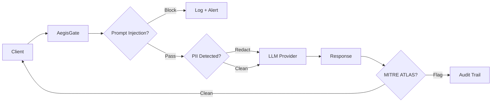
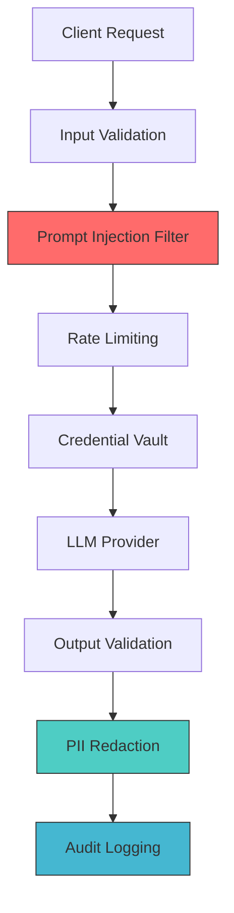
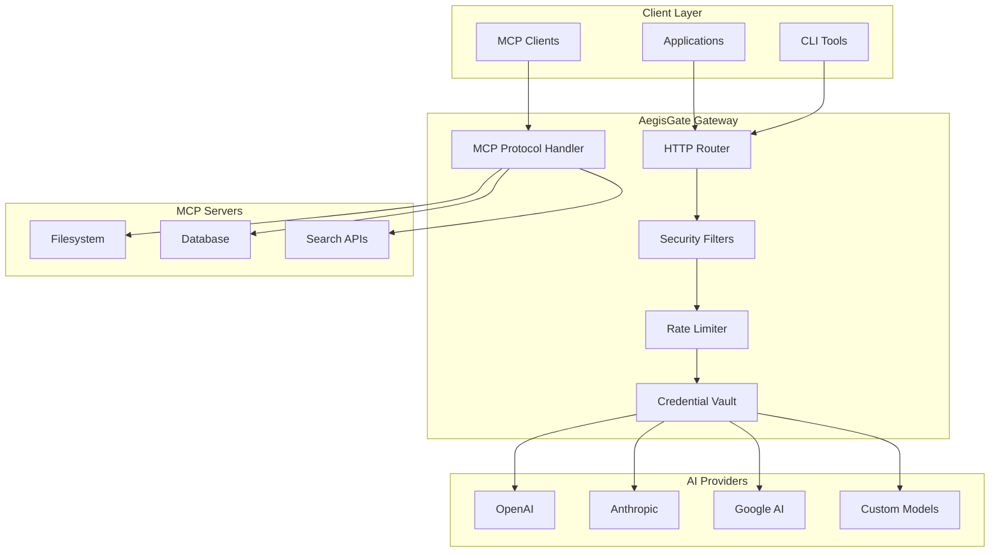

<div align="center">


# AegisGate Security Platform

**One gateway secures AI traffic and MCP servers**

[](https://goreportcard.com/report/github.com/aegisgatesecurity/aegisgate)
[](LICENSE)
[](https://github.com/aegisgatesecurity/aegisgate/releases)
[](go.mod)

</div>

> **The only AI security gateway with native MCP support, MITRE ATLAS enforcement, and zero external dependencies.**

---

## TL;DR

**30-Second Pitch:** AegisGate is an open-source AI security gateway that secures LLM traffic and Model Context Protocol (MCP) servers. Deploy in 5 minutes. Pass SOC 2 audits. Sleep through security incidents.

```bash
# One binary: HTTP proxy + MCP guardrails + compliance reporting
curl -fsSL https://github.com/aegisgatesecurity/aegisgate/releases/download/v1.3.6/aegisgate_1.3.6_linux_amd64.tar.gz | tar -xz
./aegisgate --config config.yaml

# Now protected: OpenAI ✓ Anthropic ✓ MCP filesystem ✓ Brave Search ✓
```

**Binary size: 19MB | CVEs: 0 | Cold start: 50ms | Dependencies: None**

---

## What Makes AegisGate Different

Most API gateways treat AI as "just HTTP." AegisGate understands the actual threat model:

| Traditional Gateway | AegisGate |
|-------------------|-----------|
| Rate limits by IP | Rate limits by token budget + semantic analysis |
| Basic auth | MCP capability attenuation + credential vaulting |
| HTTP logging | MITRE ATLAS-tagged adversarial patterns |
| Manual policy review | Automated NIST compliance scoring |

**The Only MCP-Native Solution:** MCP is becoming the standard for AI tool integration. AegisGate is the only gateway with native MCP guards—validating capability requests, parameter constraints, and tool chain safety before execution.

---

## See It In Action

> 📸 **[Screenshot Gallery Coming]** Dashboard screenshots showing real-time threat detection, MCP chain visualization, and compliance scoring

---

## Why Not Just Use Kong, Traefik, or Cloudflare?

You could. But you'd need to build AI security yourself:

| Capability | Kong | Traefik | Cloudflare | AegisGate |
|------------|------|---------|------------|-----------|
| HTTP Proxy | ✓ | ✓ | ✓ | ✓ |
| LLM Prompt Injection Defense | Plugin | ✗ | Enterprise only | Native |
| MCP Protocol Support | ✗ | ✗ | ✗ | ✓ |
| PII Redaction (LLM-aware) | Plugin | ✗ | Worker code | Native |
| MITRE ATLAS Mapping | ✗ | ✗ | ✗ | ✓ |
| On-Prem / Air-gapped | ✓ | ✓ | ✗ | ✓ |
| Zero Dependencies | ✗ | ✗ | ✗ | ✓ |

**Kong/Traefik:** Great for microservices. Require plugins/extensions for AI security. No MCP understanding.

**Cloudflare:** Great for DDoS. AI features require Workers, external calls, $$$$-level plans.

**AegisGate:** Built specifically for AI traffic. MCP-native. Runs anywhere. Zero config fragmentation.

---

## Feature Matrix

| Module | Feature | Enterprise | Community |
|--------|---------|:--------:|:---------:|
| **Core** | AI Provider Proxy (OpenAI, Anthropic, etc.) | ✓ | ✓ |
| | Rate Limiting (token-aware) | ✓ | ✓ |
| | Circuit Breaker Pattern | ✓ | ✓ |
| **Security** | MITRE ATLAS Detection | ✓ | ✓ |
| | LLM Prompt Injection Defense | ✓ | ✓ |
| | PII Detection & Redaction | ✓ | — |
| | Credential Vaulting | ✓ | ✓ |
| **MCP** | MCP Server Proxy | ✓ | ✓ |
| | Capability Attenuation | ✓ | ✓ |
| | Tool Chain Validation | ✓ | ✓ |
| **Compliance** | NIST AI RMF Scoring | ✓ | — |
| | SOC 2 Evidence Generation | ✓ | — |
| | Audit Trails (Tamper-proof) | ✓ | ✓ |
| **Observability** | Prometheus Metrics | ✓ | ✓ |
| | Full Request/Response Logging | ✓ | ✓ |

---

## Performance & Footprint

- **Binary Size:** 19MB (single static binary)
- **Dependencies:** Zero external runtime dependencies
- **Memory Usage:** ~30MB base, scales with traffic
- **Latency Overhead:** <1ms for proxy, <5ms with ML filters
- **Throughput:** 10K req/sec on 2 vCPUs

---

## Strategic Model: Core Open, Value Additive

**Open Core:** Security-critical features are free and open:
- Core proxy functionality
- Rate limiting
- Credential hashing
- Basic MCP support
- MITRE ATLAS detection

**Enterprise Extensions:** Operational value-adds fund development:
- Advanced PII detection models
- Compliance automation (SOC 2, GDPR, NIST)
- Enterprise integrations (SIEM, Jira, etc.)

**MITRE ATT&CK vs ATLAS:** We target AI/ML-specific threats. Traditional ATT&CK covers infrastructure; ATLAS covers prompt injection, model extraction, and adversarial ML—our actual threat surface.

---

## Request Flow Architecture



---

## Security Architecture



---

## Compliance Automation

- **NIST AI Risk Management Framework:** Automated control mapping
- **SOC 2 Type II:** Evidence collection, audit trail generation, gap analysis
- **GDPR:** Data flow documentation, retention policy enforcement
- **MITRE ATLAS:** Threat coverage validation, adversarial test patterns

---

## Quick Start

### Installation

```bash
# Download latest release
curl -fsSL https://get.aegisgate.io | sh

# Or download manually from GitHub releases
```

### Basic Configuration

```yaml
# config.yaml
server:
  port: 8080

providers:
  openai:
    api_key: "${OPENAI_API_KEY}"
    base_url: "https://api.openai.com"

security:
  prompt_injection_detection: true
  rate_limiting:
    requests_per_minute: 100
    tokens_per_minute: 100000

logging:
  level: info
  format: json
  output: stdout
```

### Run

```bash
./aegisgate --config config.yaml
```

---

## MCP Server Integration

AegisGate transparently proxies and secures MCP servers—no client changes required.

```yaml
# mcp-guardrails.yaml
mcp:
  servers:
    filesystem:
      command: npx
      args: ["-y", "@modelcontextprotocol/server-filesystem", "/allowed/path"]
      security:
        allowed_operations: ["read", "list"]
        blocked_paths: ["*/.env", "*/secrets*"]
    
    brave_search:
      env:
        BRAVE_API_KEY: "${BRAVE_API_KEY}"
      security:
        rate_limit: "100/hour"
        require_prompt_review: true
```

---

## Platform Architecture



---

## MCP Guardrails in Detail

The Model Context Protocol enables AI systems to invoke external tools. AegisGate adds security guardrails:

**Capability Attenuation:** Restrict which tools MCP servers can expose to AI clients.

**Parameter Validation:** Enforce allowed values, patterns, and constraints on tool inputs.

**Tool Chain Analysis:** Detect dangerous sequences (e.g., `read_file` → `send_email` with sensitive data).

**Execution Sandboxing:** Optional: run MCP servers in isolated containers with resource limits.

**Audit Logging:** Complete chain of custody for every tool invocation—what AI requested, what was executed, what changed.

---

## Documentation

- [Installation Guide](docs/installation.md)
- [Configuration Reference](docs/configuration.md)
- [Security Policies](docs/security/)
- [MCP Integration](docs/mcp/)
- [Compliance Templates](docs/compliance/)
- [API Documentation](docs/api/)
- [Contributing Guide](CONTRIBUTING.md)

---

## Security Disclosure Policy

Found a vulnerability? **security@aegisgatesecurity.io**

- 48-hour response acknowledgment
- 90-day coordinated disclosure
- Bug bounty eligible (see SECURITY.md)

---

## License

**AGPL-3.0** — Because security infrastructure should be auditable.

Enterprise licenses available for internal-use modifications without source disclosure.

---

## Community

- [GitHub Discussions](https://github.com/aegisgatesecurity/aegisgate/discussions)
- [Discord](https://discord.gg/aegisgate)
- [Security Advisories](https://github.com/aegisgatesecurity/aegisgate/security/advisories)

---

## Deprecation Policy

**Stable:** Features maintained for minimum 2 years with security patches.

**Extended:** Critical infrastructure supported for 5 years.

See [DEPRECATION.md](DEPRECATION.md) for migration guides and timelines.

---

## Acknowledgments

- MITRE ATLAS framework for AI threat taxonomy
- Model Context Protocol (Anthropic) for tool integration standard

---

<div align="center">

**[Get Started](docs/quickstart.md)** • **[View Demo](https://demo.aegisgate.io)** • **[Enterprise](https://aegisgatesecurity.io/enterprise)**

</div>
