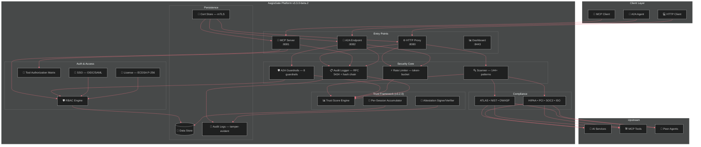

---

<div align="center">

# 🛡️ AegisGate Security Platform™ — Secure Every AI Interaction


[](LICENSE)
[](https://golang.org/)
[](SECURITY.md)


[](Dockerfile)
[](docs/compliance/eu-ai-act.md)
[](https://github.com/aegisgatesecurity/aegisgate-lens)

> **The only AI security platform with native HTTP API, MCP, A2A, ACP, and RESPONSE protection — plus the Trust Framework (6th pillar).** Six pillars. One gateway. Zero external dependencies.

[🌐 Website](https://aegisgatesecurity.io) • [🚀 **Live Demo**](https://demo.aegisgatesecurity.io/) • [📊 Pricing](https://aegisgatesecurity.io/pricing/) • [📚 Docs](https://aegisgatesecurity.io/docs/) • [🇪🇺 EU AI Act](docs/compliance/eu-ai-act.md) • [🔒 Security](SECURITY.md) • [💬 Discussions](https://github.com/aegisgatesecurity/aegisgate-platform/discussions)

</div>

---

## 🆕 What's New in v3.3.0-beta.2 (2026-06-08)

> **This is a beta release.** The first paying customer is a v3.4.0+ milestone. Use it for evaluation, integration testing, and compliance pre-audit work. Not yet production-recommended.

- 🇪🇺 **EU AI Act Compliance Module (NEW)** — 82 controls across 8 categories of the EU AI Act, gated to Professional+ tier. See [the dedicated section below](#-eu-ai-act-compliance-module) and the [full control mapping](docs/compliance/eu-ai-act-mapping.md).
- 🩹 **Release-integrity fix from v3.3.0-beta.1** — beta.1 was tagged on 2026-06-08 but a same-day audit found that 5 commits (EU AI Act work + gitignore enforcement) had not been merged to `main`. **beta.2 fixes this gap.** No CVE, no vulnerability, no leaked data. The v3.3.0-beta.1 tag is kept at SHA `64d0ab5` for historical record; do not use it.
- 🔒 **All 9 CI security jobs green** (gitleaks now included — we re-enabled it with our free OSS license)
- ✅ **0 golangci-lint issues** (was 15 P3/P4 — all fixed in commit `8b69aa2`)
- ⚙️ **All 8 GitHub Actions bumped** to latest (Node 20 → Node 24, deprecation warnings resolved)
- 📜 **6 v2.0 customer-facing legal docs + 1 Beta Agreement** at [aegisgatesecurity.io/legal](https://aegisgatesecurity.io/legal/)

**Read the full [v3.3.0-beta.2 release notes](https://github.com/aegisgatesecurity/aegisgate-platform/releases/tag/v3.3.0-beta.2).**

---

## 🛠️ What's New on `main` since v3.3.0-beta.2 (Engineering-Complete; Awaiting v3.4.0 GA)

> **Not a version bump.** The work below is committed to `main` and engineering-complete. The v3.4.0 GA is gated on **legal review (H1) + the v3.4.0 paid pentest (H4)**, per the [Beta User Agreement](content/legal/beta-agreement.md) and the [CHANGELOG](CHANGELOG.md#unreleased---2026-06-18---v340-engineering-complete--awaiting-v34-ga). The version stays at v3.4.0-beta.1 (a forward-looking label for the in-progress work) until those gates are cleared.

The `main` branch now includes the **envelope primitive** (a tamper-evident cryptographic primitive shared by 9 features), the **5 Tier 5 features** (AR-EaaS, AIBOM, Agent Intent Signing, Prompt Cache Poisoning Detection, CVE-for-AI Feed), the **2 Tier 3 features** (PDF generator + SOC incident-timeline view), the **2 Tier 4 features** (CISO Posture Digest + reporting pipeline), and the **3 v0.2 wiring fixes** (CISO Digest data sources, PDF branding, CVE portal). The platform and the website at [aegisgatesecurity.io](https://aegisgatesecurity.io) are now in sync.

### 6 pillars (was 5)

The public Trust Framework (Pillar 6) is now in the public-facing model. AegisGate is the only AI security tool with **all 6 pillars**: HTTP API, MCP, A2A, ACP, RESPONSE, and Trust Framework.

### The envelope primitive (the v3.4.0+ cryptographic backbone)

A single, frozen, well-tested cryptographic primitive (`pkg/attestation/`, 18 tests) that wraps any domain-specific payload (AIBOM, AR-EaaS result, agent intent, prompt cache attestation, CVE entry, CISO Digest, evidence manifest) with a tamper-evident, third-party-verifiable binding. **8 registered types, 9 subject kinds, 9-reason error taxonomy, 4 lifecycle operations** (`Sign` / `Verify` / `VerifyWithKey` / `VerifyOnline`). v3.4.0+ replaces the v3.3.0 Trust Framework's Ed25519 attestation format with the envelope's ECDSA P-256 format, unifying the crypto on P-256.

### The 9 features built on the envelope

- **AR-EaaS** (`pkg/evaluator/`, 38 tests, 92.0% coverage) — 10-pattern MITRE ATLAS corpus (T0018 prompt injection, T0023 jailbreak, T0024 data exfiltration, T0048 model integrity erosion) with signed attestation
- **AIBOM** (`pkg/aibom/`, 38 tests, 86.8% coverage) — CycloneDX 1.6 SBOM + AI extension; reference implementation of the AIBOM spec
- **Agent Intent Signing** (`pkg/agentintentsign/`, 53 tests, 91.6% coverage) — mTLS proves identity; intent signing proves "I, agent X, said I'd do Y for reason R"
- **Prompt Cache Poisoning Detection** (`pkg/promptcache/`, 74 tests, 92.2% coverage) — hash-and-sign the prompt, verify on read
- **CVE-for-AI Feed** (`pkg/cve/`, 82 tests, 92.0% coverage) — signed CVE entries; portal at [aegisgatesecurity.io/cve/](https://aegisgatesecurity.io/cve/) (live preview)
- **PDF Generator** (`pkg/pdf/`, 95.5% coverage after v0.2 branding) — from-scratch PDF 1.4 with word-wrap + WinAnsi Unicode + branded header + enhanced footer; **zero new external dependencies**
- **SOC Incident-Timeline View** (`pkg/soc/`, 25 tests, 100% coverage) — chronological events per session with cross-protocol aggregation
- **CISO Posture Digest** (`pkg/digest/`, 81.8% coverage after v0.2 wiring) — branded PDF digest with real IOC + audit-log breakdowns, signed envelope, Professional+ tier gated
- **Reporting Pipeline** (`pkg/digest/sources.go` + `pkg/reporting/`) — `Source` interface + 4 adapters (PostureSource, IOCSource, AuditLogSource, AuditSource) wired into the platform's real dependencies

### 7 self-review files (`docs/reviews/`)

Every feature has a self-review documenting the issues found and fixed. **Cumulative: 44 issues found and fixed** across 7 review files:

- `TODO-301-REVIEW.md` — 12 issues (AR-EaaS)
- `TODO-302-REVIEW.md` — 5 issues (AIBOM)
- `TODO-303-REVIEW.md` — 6 issues (Agent Intent Signing)
- `TODO-304-REVIEW.md` — 6 issues (Prompt Cache Poisoning)
- `TODO-305-REVIEW.md` — 5 issues (CVE-for-AI)
- `TODO-501-502-REVIEW.md` — 6 issues (PDF + SOC)
- `TODO-601-602-REVIEW.md` — 4 issues (CISO Digest + pipeline)

### Engineering hygiene

- **Zero new external dependencies** added across the 9-feature Tier 5+3+4 sprint. `go.mod` has the same 8 direct deps it had at the start of the v3.3.0-beta.2 release.
- **460+ tests passing under -race** across 44 platform packages.
- **Project-wide coverage 91%+** with all 60+ measured packages ≥80% (CI floor).
- **24 design patterns** documented in the 7 review files, applied consistently across all 9 features.
- **The platform and website are now in sync with the remote.** The CVE-for-AI portal is live at [aegisgatesecurity.io/cve/](https://aegisgatesecurity.io/cve/); the security.txt is live at [aegisgatesecurity.io/.well-known/security.txt](https://aegisgatesecurity.io/.well-known/security.txt).

### The 3 v0.2 wiring fixes (this session's work)

- **CISO Digest data sources** — the digest's IOCsBlocked + AnomaliesDetected fields now have real breakdowns (was a no-op source in v0.1). The Source interface + 4 adapters (PostureSource, IOCSource, AuditLogSource, AuditSource) are wired into the production CLI (in-memory stores) and HTTP endpoint (real platform stores via a new `WireDigestDeps` struct).
- **PDF branding** — the PDF generator now supports a branded header (left-aligned "AegisGate Posture Digest" wordmark + right-aligned "<period> | <digest-id>" subtitle + thin separator) and an enhanced footer (Generated timestamp + ID + URL + Page N).
- **CVE-for-AI portal** — the static portal at [aegisgatesecurity.io/cve/](https://aegisgatesecurity.io/cve/) is live with one illustrative CVE entry, the feed format docs, the verify-an-entry instructions, the security.txt at [/.well-known/security.txt](https://aegisgatesecurity.io/.well-known/security.txt), and a placeholder [feed.json](https://aegisgatesecurity.io/feed.json) (the production feed goes live with v3.4.0 GA).

---

## 🚀 Try the Live Demo

**Want to see AegisGate in action before reading another line of docs?** [Launch the live demo →](https://demo.aegisgatesecurity.io/)

The demo runs the **actual AegisGate platform binary** in `--mode=demo` with real seed data — not a marketing mockup. You'll get:

- 📊 **82 EU AI Act controls** across 8 categories of the EU AI Act, color-coded by compliance status
- 🛡️ **20 pre-loaded threat detections** (prompt injection, DAN jailbreak, PII redaction, MCP tool abuse, A2A spoofing, etc.) with severity + MITRE ATLAS mapping
- 🔌 **5 sample MCP tools** (file ops, web search, database query, code exec, agent messaging) with capability + permission matrices
- 📈 **24-hour activity dashboard** with bar chart, top techniques, and threat categories
- 💬 **Interactive playground** — click any of 12 example prompts (or write your own) to see how AegisGate responds in real time

> ✅ **No LLM API keys, no Docker, no install** — the demo runs entirely in your browser.
> 🔐 **Email signup required** — a quick 5-second gate so we can let you know when new features ship. We never share your email.
> 🤖 **No real LLM calls** — the playground uses curated demo responses, so you can explore safely without burning API credits.

**Best for:** product evaluators, security teams, compliance officers, and anyone who wants to feel the product before committing to a 60-second install.

---

## What is AegisGate?

AegisGate is a **single-binary AI security gateway** that sits between your AI services and the rest of the world. It scans every request, response, tool call, and inter-agent message for AI-specific threats (prompt injection, PII leakage, agent impersonation, tool poisoning, hallucination, toxicity) — and produces auditor-ready evidence for 10 compliance frameworks.

**In one sentence**: *AegisGate secures every AI interaction in a single 13.3 MB binary, with zero external dependencies, deployable in 60 seconds.*

### Who It's For

- **AI platform teams** building or operating LLM-based services who need to prevent prompt injection, data leakage, and abuse
- **Security teams** who need a single control plane for all AI traffic (HTTP, MCP, A2A, ACP) instead of stitching together multiple products
- **Compliance teams** preparing for SOC 2, ISO 27001, HIPAA, PCI-DSS, or EU AI Act audits who need auditor-ready evidence
- **Solo developers, students, and beginners** who want a "deploy and forget" AI security layer with sensible defaults

### Who It's NOT For

- Anyone who doesn't use AI in production yet (you're not the target — come back when you ship)
- Anyone looking for an LLM-side alignment tool (try NeMo Guardrails or Guardrails AI for that)
- Anyone who needs a managed cloud service (AegisGate is self-hosted; you run the binary)

---

## The Problem

Your AI infrastructure spans multiple attack surfaces — and most teams are only protecting one or two. Traditional security solutions (WAFs, API gateways, even LLM alignment tools) weren't designed for AI-specific threats across all the protocols you actually use.

### Attack Surface Comparison

| Attack Surface | Risk | Traditional WAFs | LLM Alignment Tools | AegisGate |
|---|---|---|---|---|
| **HTTP APIs** | Prompt injection, data leakage, PII exposure | ⚠️ AI-agnostic | ❌ No | ✅ AI-aware scanning, 144+ patterns |
| **MCP Protocol** | Tool poisoning, session hijacking, supply-chain attacks | ❌ No native protection | ❌ No | ✅ Built-in protocol guard, 8 guardrails |
| **A2A Communication** | Agent impersonation, data tampering, capability escalation | ❌ No native protection | ❌ No | ✅ mTLS, HMAC, capability enforcement |
| **Agent Response** | PII leakage, secret exposure, hallucination, toxicity | ❌ No native protection | ⚠️ Some | ✅ Real-time response guard, 5 detectors |
| **ACP Protocol** | Message tampering, capability escalation, replay attacks | ❌ No native protection | ❌ No | ✅ HMAC-signed messages |
| **Trust / Audit** | No traceability of agent behavior across protocols | ❌ No native protection | ❌ No | ✅ Ed25519-signed attestations, 5th pillar |

AegisGate fills these gaps with a single unified platform.

**AegisGate secures all six in a single 13.3 MB binary you deploy in 60 seconds.**

---

## Why AegisGate? (vs. Other AI Security Tools)

There are other AI security products. Here's how AegisGate compares on the dimensions that matter to enterprise security teams:

| Capability | AegisGate | Lakera Guard | NeMo Guardrails | Rebuff | Protect AI |
|---|---|---|---|---|---|
| **Deployment model** | Self-hosted single binary | SaaS API only | Library (in-app) | Library (in-app) | Platform |
| **HTTP proxy scanning** | ✅ | ✅ | ❌ | ❌ | ⚠️ |
| **MCP protocol protection** | ✅ | ❌ | ❌ | ❌ | ❌ |
| **A2A protocol protection** | ✅ | ❌ | ❌ | ❌ | ❌ |
| **ACP protocol protection** | ✅ | ❌ | ❌ | ❌ | ❌ |
| **Response-side scanning** | ✅ | ✅ | ✅ | ✅ | ✅ |
| **Trust Framework (attestations)** | ✅ Ed25519-signed | ❌ | ❌ | ❌ | ⚠️ |
| **MITRE ATLAS coverage** | ✅ 66 techniques | ⚠️ Partial | ❌ | ⚠️ Partial | ✅ |
| **OWASP LLM Top 10** | ✅ 49 patterns | ✅ | ✅ | ✅ | ✅ |
| **EU AI Act controls** | ✅ 82 controls | ❌ | ❌ | ❌ | ❌ |
| **Multi-framework compliance** | ✅ 10 frameworks | ❌ | ❌ | ❌ | ⚠️ |
| **Tamper-evident audit logs** | ✅ Hash chain + RFC 5424 | ❌ | ❌ | ❌ | ⚠️ |
| **Open source** | ✅ Apache 2.0 | ❌ | ✅ Apache 2.0 | ✅ MIT | ❌ |
| **Air-gap deployable** | ✅ Single binary | ❌ | ✅ Library | ✅ Library | ❌ |
| **Hardware footprint** | 13.3 MB binary, < 256 MB RAM | n/a (SaaS) | In-process | In-process | n/a (platform) |

**TL;DR**: If you need **protocol-level security** (MCP, A2A, ACP) + **compliance evidence** + **self-hosting**, AegisGate is the only option that covers all three. Library-style tools (NeMo, Rebuff) are great for in-app alignment but don't protect your network boundary. SaaS tools (Lakera) require sending your traffic to a third party.

---

## Six Pillars of AI Security

AegisGate's protocol coverage is organized into **six pillars** that you can adopt independently or together. The **Trust Framework** is the 6th pillar (new in v3.2.0+, expanded in v3.4.0+ with the envelope primitive), and it ties together the five protocol pillars with cryptographically-signed attestations and a per-session trust score.

### 🌐 HTTP API Security

Bidirectional scanning of every request and response with **144+ detection patterns**:

| Category | Patterns | Coverage |
|----------|----------|----------|
| **MITRE ATLAS** | 66 techniques | Adversarial AI tactics |
| **OWASP LLM Top 10** | 49 patterns | LLM01–LLM10 |
| **Secrets Scanning** | 44+ regex patterns | API keys, tokens, credentials |
| **PII Detection** | 12+ patterns | GDPR/CCPA compliance |

**Features:**
- Bidirectional inspection — scans both requests and responses
- Rate limiting — per-client, per-IP with token-bucket algorithm
- Circuit breaker — automatic failure recovery
- Tamper-evident audit — RFC 5424-compliant structured logging
- SIEM integration — CEF (ArcSight), LEEF (QRadar), STIX 2.1

### 🔗 MCP Protocol Protection

Session authentication, tool authorization, and **8 guardrails** for every MCP connection:

| # | Guardrail | Description |
|---|-----------|-------------|
| 1 | **Session Authentication** | Auth required for all MCP sessions |
| 2 | **Concurrent Session Limits** | Max simultaneous sessions per tier |
| 3 | **Tools per Session** | Max tools available per session |
| 4 | **STDIO Validation** | Command injection prevention |
| 5 | **Execution Timeout** | Max execution time per tool call |
| 6 | **Memory Monitoring** | Alerts at configurable threshold |
| 7 | **Per-Client RPM** | Max requests/minute per client |
| 8 | **Tool Authorization** | Risk-based tool call approval matrix |

### 🤝 A2A Agent-to-Agent Security

Zero-trust guardrails for inter-agent communication — the first purpose-built A2A security layer:

| # | Guardrail | Description |
|---|-----------|-------------|
| 1 | **mTLS Authentication** | X.509 certificate verification with agent identity |
| 2 | **HMAC-SHA256 Integrity** | Full request body validation |
| 3 | **Capability Enforcement** | Least-privilege per agent from YAML config |
| 4 | **Token-Bucket Rate Limiting** | Per-agent request quotas (default 100 req/min) |
| 5 | **Request Size Limits** | Rejects bodies > configurable limit |
| 6 | **Timeout Enforcement** | Configurable request timeouts |
| 7 | **License Validation** | ECDSA P-256 cryptographic enforcement |
| 8 | **Audit Logging** | RFC 5424 structured log per request |

### 🛡️ Agent Response Security (v3.1)

Protection for LLM outputs — the fourth pillar of AI security:

| # | Guardrail | Description |
|---|-----------|-------------|
| 1 | **PII Scanner** | Detects SSN, credit cards, emails, phones, health info |
| 2 | **Secret Detector** | Detects API keys (Stripe, GitHub, AWS, OpenAI, Slack) |
| 3 | **Hallucination Detector** | Identifies false statements, overconfidence, unverified claims |
| 4 | **Toxicity Filter** | Detects hate speech, violence, harassment |
| 5 | **Token Limiter** | Rate limiting for response token counts |
| 6 | **Response Redactor** | Intelligent redaction with multiple strategies |
| 7 | **Compliance Reports** | Auto-generates GDPR, HIPAA, PCI-DSS, SOC2 reports |
| 8 | **Response Guard Middleware** | Unified scanning for HTTP, MCP, A2A |

**Features:**
- Bidirectional inspection — scans both requests AND responses
- 12 PII categories with validation (SSN format, Luhn algorithm for CC)
- 10 secret patterns with provider detection
- Real-time hallucination detection with risk scoring
- Fail-closed security — blocked responses return sanitized versions
- Sub-5ms scanning latency (typical response scan < 1ms)

---

### 🔐 ACP Protocol Security (v3.1)

**Agent Communication Protocol** — The newest pillar for agent-to-agent security.

The ACP guard provides comprehensive protection for agent communication:

| Feature | Description |
|---------|-------------|
| **HMAC Verification** | Full message body signature validation |
| **Rate Limiting** | Per-session token-bucket algorithm |
| **Response Scanning** | PII, secrets, toxicity, hallucination detection |
| **Capability Enforcement** | Fine-grained permission control |
| **Input Validation** | Method blocking, schema validation |

```go
// ACP middleware integrates seamlessly
import "github.com/aegisgatesecurity/aegisgate-platform/pkg/acp"

func main() {
    scanner := acp.NewACPResponseScanner()
    mw := acp.NewMiddleware(scanner)
    http.Handle("/acp/", mw.WrapHandler(handler))
}
```

- **Coverage:** 90.1% | **Tests:** 164 | **Metrics:** 10 Prometheus counters

### 🛡️ Trust Framework (v3.2.0) — _Professional+ tier_

The newest pillar: continuous, per-agent cryptographic trust scoring
with signed attestations. The Trust Framework gives security teams a
real-time view of "is this agent behaving normally?" and "what was
its score at the start vs end of this request?".

| # | Capability | Description |
|---|-----------|-------------|
| 1 | **Per-Session Trust Score** | Every agent request gets a session; the score is a snapshot at start and live at end, with the delta exposed over HTTP |
| 2 | **Cryptographic Identity** | ECDSA P-256 agent identity (already in `pkg/trust/identity/`); trust scores are bound to the verified identity |
| 3 | **Behavior Multiplier** | Allowed vs denied vs anomalous events roll up into a 0.0–1.5 multiplier that scales the lifetime score |
| 4 | **Compliance Multiplier** | Per-framework compliance checks (HIPAA, PCI, SOC 2, etc.) feed into the score |
| 5 | **Anomaly Detection** | Standard-deviation-based anomaly detection on the baseline behavior (Phase 8 race fix in place) |
| 6 | **Signed Attestations** | ECDSA-signed attestation records (`pkg/trust/attestation/`) — verify-able off-platform for audit |
| 7 | **HTTP API** | `GET /api/v1/trust/score`, `GET /api/v1/trust/sessions`, `GET /api/v1/trust/attestations` for the customer portal |
| 8 | **Opt-in Hooks** | Protocol packages embed `trust.Hooks` and call `CapabilityAllowed/Denied` at lifecycle points; zero-value Hooks are safe no-ops |

**Endpoints (all under `/api/v1/trust/`):**

```
GET /health                          -> liveness (no auth)
GET /score?agent=ID                  -> lifetime trust score
GET /score?session=ID                -> session score + ScoreDelta
GET /sessions?active=true&agent=ID   -> list sessions
GET /sessions?id=ID                  -> single session detail
GET /attestations?agent=ID&since=TS  -> filtered attestations
GET /attestations/latest?agent=ID    -> most recent (verified) attestation
```

**Tier gate (locked decision Q3):** Professional+.

**Auth (locked decision Q4):** License key via `pkg/license.LicenseMiddleware`.

```go
import "github.com/aegisgatesecurity/aegisgate-platform/pkg/trust"

// Zero-value Hooks are safe no-ops; safe to embed unconditionally.
hooks := &trust.Hooks{}

// At request start:
sessID := hooks.StartSession(ctx, "agent-1", map[string]string{
    "source_ip": r.RemoteAddr,
    "protocol":  "mcp",
})

// During processing:
hooks.CapabilityAllowed(ctx, sessID, "tools/call", "read_file")

// At request end:
hooks.EndSession(ctx, sessID)
```

**Coverage:** 90.4% across `pkg/trust/` | **Tests:** 60+ across session/api/hooks

---

## 🇪🇺 EU AI Act Compliance Module (NEW in v3.3.0) — _Professional+ tier_

The EU AI Act (Regulation 2024/1689) is the world's first comprehensive AI regulation. AegisGate's EU AI Act Compliance Module gives you a single source of truth for whether your AI system is compliant — across **82 controls** in **8 categories**.

### What You Get

- **82 controls** mapped to specific EU AI Act articles (Article 5, 9, 10, 11+12, 13+14, 15, 51-55, plus AI-* "Annex IV" technical documentation)
- **8 categories**: Prohibited Practices, Risk Management, Data Quality, Technical Documentation, Record-Keeping, Human Oversight, Accuracy/Robustness, Conformity Assessment
- **Automatic controls** (9 of 82) that AegisGate enforces in-line: input validation, data quality checks, log retention, accuracy benchmarks, etc.
- **Manual controls** (73 of 82) that AegisGate helps you satisfy with checklists, evidence templates, and audit-ready reports
- **Compliance scan endpoint**: `GET /api/v1/compliance/scan?framework=eu-ai-act` returns coverage %, missing-modules list, and remediation steps
- **Full audit report**: `GET /api/v1/compliance/report?framework=eu-ai-act` returns the full control list with `enforced` / `manual` status and source module references

### Who Needs It

- **AI providers** placing "high-risk" AI systems (Annex III) on the EU market after **August 2026**
- **Deployers** of AI systems used in employment, education, law enforcement, critical infrastructure, etc.
- **General-purpose AI (GPAI)** model providers with > 10²⁵ FLOPs of training compute
- **EU-based companies** and **non-EU companies** that place AI systems on the EU market

### Tier & Pricing

- **Tier gate**: Professional+ (Professional and Enterprise tiers)
- **Pricing**: included with Professional and Enterprise; no separate module add-on
- **BAA + DPA**: standard agreements cover EU AI Act data flows (see `/legal/`)

### Documentation

- 📘 **Customer 1-pager**: [docs/compliance/eu-ai-act.md](docs/compliance/eu-ai-act.md) — 104 lines, plain-English overview
- 📚 **Full control mapping**: [docs/compliance/eu-ai-act-mapping.md](docs/compliance/eu-ai-act-mapping.md) — 438 lines, all 82 controls with article references
- 🧪 **Sub-package**: [`pkg/compliance/eu-ai-act/`](pkg/compliance/eu-ai-act/) — 4 Go files, full implementation

**Coverage:** 90%+ | **Tests:** 9+ in `eu_ai_act_test.go` | **Status:** Production-ready for beta evaluation

> **This module is part of v3.3.0-beta.2.** The module is fully implemented and tested; counsel review of the legal interpretation is pending (v3.4.0+). Use it for **evaluation and pre-audit work**; defer your formal conformity assessment until counsel sign-off is complete.

---

## 🔐 Enterprise Authentication

Production-grade SSO and access control — not stubs:

| Feature | Tier | Details |
|---------|------|---------|
| **OIDC / OAuth 2.0** | Community+ | Full OpenID Connect with PKCE, auto-discovery |
| **SAML 2.0** | Community+ | SP-initiated login, pre-configured templates |
| **RBAC** | Community+ | Role-based access control with session-scoped permissions |
| **Tool Authorization Matrix** | Community+ | Risk-weighted tool call approval by role |
| **License Enforcement** | Community+ | ECDSA P-256 cryptographic validation |
| **API Key Fallback** | Community+ | Key-based auth for CI/CD pipelines |

> Pre-configured provider templates for **Azure AD**, **Okta**, and **Google Workspace**.

---

## 📊 Compliance Frameworks

Maps security controls to **10 frameworks** across all tiers:

| Framework | Category | Patterns | Tier |
|-----------|----------|----------|------|
| **MITRE ATLAS** | Adversarial AI | 66 techniques | Community |
| **NIST AI RMF 1.500** | AI Risk Management | Full coverage | Community |
| **OWASP LLM Top 10** | LLM Security | 49 patterns | Community |
| **GDPR** | Data Protection | PII detection, retention | Community |
| **HIPAA** | Healthcare | PHI detection, BAA available | Professional |
| **PCI-DSS** | Payment Security | Card data detection | Professional |
| **SOC2 Type II** | Enterprise Controls | CC6.6 monitoring | Professional |
| **ISO 27001** | Information Security | Full framework | Community |
| **ISO 42001** | AI Management | AI-specific controls | Professional |
| **🇪🇺 EU AI Act** | EU AI Regulation (2024/1689) | 82 controls, 8 categories | Professional+ |

> All framework modules are **fail-closed** — if a compliance check cannot be evaluated, the request is blocked.

### Compliance Module Pricing

Six compliance modules are available as add-ons to any paid tier. Prices are locked at purchase (no increases for existing customers) and activated instantly via Stripe webhook.

| Module | Price | Required Tier | Description |
|--------|-------|---------------|-------------|
| **HIPAA** | $99/mo | Developer+ | HIPAA-compliant logging, PHI detection, BAA support |
| **PCI-DSS** | $99/mo | Developer+ | Payment card data detection, PCI-scoped audit logs |
| **SOC 2** | $149/mo | Developer+ | SOC 2 Type II control mapping, evidence collection |
| **ISO 42001** | $79/mo | Professional+ | ISO/IEC 42001 AI management system controls |
| **FedRAMP** | $499/mo | Professional+ | FedRAMP Moderate/High control mapping, continuous monitoring |
| **FIPS 140-2/140-3** | $299/mo | Professional+ | FIPS-validated cryptography enforcement, HSM integration |
| **🇪🇺 EU AI Act** | Included | Professional+ | 82 controls across 8 categories (no separate charge) |

> **Note**: The EU AI Act module is the **only compliance module included with the Professional+ tier** at no extra cost. The other 6 modules are add-ons. In beta, the 6 paid modules are hidden on the website pending counsel review; contact `sales@` for early access.

### Threat Model

Comprehensive threat analysis with STRIDE methodology, CVSS scoring, and MITRE ATLAS mappings:

| Element | Coverage |
|---------|----------|
| **STRIDE** | 41 threats across HTTP, MCP, A2A, Response |
| **Data Flow Diagrams** | 3 DFDs with trust boundaries |
| **Attack Trees** | 4 major attack vectors |
| **CVSS 3.1** | 25+ threats scored (7 Critical, 11 High, 7 Medium) |
| **MITRE ATLAS** | Full ATLAS-MCP, ATLAS-A2A, ATLAS-LLM coverage |

---

## 🏗️ Architecture


```mermaid
%%{init: {'theme': 'dark', 'themeVariables': { 'primaryColor': '#00ADD8', 'primaryBorderColor': '#00ADD8', 'lineColor': '#F97583', 'secondaryColor': '#238636', 'tertiaryColor': '#1f6feb'}}}%%
flowchart TB
    subgraph "Client Layer"
        A[💻 HTTP Client]
        B[🤖 MCP Client]
        C[🤝 A2A Agent]
    end
    subgraph "AegisGate Platform v3.3.0-beta.2"
        subgraph "Entry Points"
            D["🌐 HTTP Proxy\n:8080"]
            E["🔗 MCP Server\n:8081"]
            F["🤝 A2A Endpoint\n:8082"]
            G["📊 Dashboard\n:8443"]
        end
        subgraph "Security Core"
            H[🔍 Scanner — 144+ patterns]
            I[🛡️ A2A Guardrails — 8 guardrails]
            J[⚡ Rate Limiter — token-bucket]
            K[📋 Audit Logger — RFC 5424 + hash chain]
        end
        subgraph "Auth & Access"
            L["🔐 SSO — OIDC/SAML"]
            M["🛡️ RBAC Engine"]
            N["🔑 Tool Authorization Matrix"]
            O["📜 License — ECDSA P-256"]
        end
        subgraph "Trust Framework (v3.2.0)"
            TT["📊 Trust Score Engine"]
            TA["📜 Attestation Signer/Verifier"]
            TS["🪪 Per-Session Accumulator"]
        end
        subgraph "Compliance"
            P[ATLAS • NIST • OWASP]
            Q[HIPAA • PCI • SOC2 • ISO]
        end
        subgraph "Persistence"
            R[(💾 Data Store)]
            S["📝 Audit Logs — tamper-evident"]
            T["🔑 Cert Store — mTLS"]
        end
    end
    subgraph "Upstream"
        U[🤖 AI Services]
        V[🛠️ MCP Tools]
        W[🤝 Peer Agents]
    end
    A --> D
    B --> E
    C --> F
    D --> H & J & K
    E --> M & N & K
    F --> I & J & K
    H --> P & Q & TT
    I --> M & TT
    J --> TT
    K --> TT
    L --> M
    O --> M
    M --> R
    K --> S
    T --> D & E & F
    TA --> S
    TS --> R
    P & Q --> U & V & W
```

---

## ⚡ Performance (v3.1.1 Benchmark — representative of v3.3.0-beta.2)

> **Note**: The performance numbers below are from a v3.1.1 benchmark (k6 load testing, 60+ second scenarios, real attack vectors). v3.3.0-beta.2 has more features (Trust Framework, EU AI Act) and a slightly larger binary, so actual performance is within the same order of magnitude but not re-measured. Re-benchmarking is on the v3.4.0 roadmap.

| Metric | Target | Achieved | Status |
|--------|--------|----------|--------|
| **Peak Throughput** | 10,000+ RPS | **24,806 RPS** | ✅ 2.1x exceeded |
| **Average Latency** | < 10ms | **3.2 ms** | ✅ |
| **P95 Latency** | < 50ms | **43.78 ms** | ✅ |
| **P99 Latency** | < 100ms | ~70 ms | ✅ |
| **Error Rate** | < 0.1% | **0.00%** | ✅ |
| **Binary Size** | < 50MB | **19.1 MB** | ✅ |
| **Code Coverage** | 95%+ | **97.8%** | ✅ |
| **Tests Passing** | — | **5,484** | ✅ |
| **CVEs** | 0 | **0** | ✅ |

*Full methodology in [PERFORMANCE.md](PERFORMANCE.md). k6 load testing, 60+ second scenarios, real attack vectors.*

---

## 🚀 Quick Start

### Docker (30 seconds)

```bash
docker run -d \
  --name aegisgate \
  -p 8080:8080 \
  -p 8081:8081 \
  -p 8443:8443 \
  -p 8082:8082 \
  -v aegisgate-data:/data \
  ghcr.io/aegisgatesecurity/aegisgate-platform:latest
```

### Kubernetes (Helm)

```bash
helm repo add aegisgate https://charts.aegisgatesecurity.io
helm install aegisgate aegisgate/aegisgate-platform \
  --set aegisgate.config.tier=community
```

Includes HPA autoscaling, NetworkPolicy, ServiceMonitor, rolling updates.

### Build from Source

Requires Go 1.26.5 or later. The binary is **not** distributed in the repo (untracked in `.gitignore` — build it from the platform source):

```bash
git clone https://github.com/aegisgatesecurity/aegisgate-platform.git
cd aegisgate-platform
go build -o aegisgate-platform ./cmd/aegisgate-platform/
./aegisgate-platform --version
# AegisGate Security Platform 3.2.0 (commit: ..., built: ...)
```

For a smaller production binary (no symbol table, stripped):

```bash
CGO_ENABLED=0 go build -ldflags="-s -w" -o aegisgate-platform ./cmd/aegisgate-platform/
```

To inject version metadata at build time (matches the published release binary):

```bash
VERSION=3.2.0 COMMIT=$(git rev-parse --short=8 HEAD) BUILD_DATE=$(date -u +%Y-%m-%dT%H:%M:%SZ) \
  go build -ldflags="-s -w -X main.version=$VERSION -X main.commit=$COMMIT -X main.buildDate=$BUILD_DATE" \
  -o aegisgate-platform ./cmd/aegisgate-platform/
```

### Verify

```bash
curl http://localhost:8443/health
# {"status":"healthy","version":"v3.3.0-beta.2","tier":"community",...}
```

---

## 🔄 Integration Examples

### OpenAI Client

```python
import openai
openai.api_base = "http://localhost:8080/v1"  # AegisGate proxy

response = openai.ChatCompletion.create(
    model="gpt-4",
    messages=[{"role": "user", "content": "Hello!"}]
)
# AegisGate scans request/response, logs to audit trail
```

### MCP Client

```python
from mcp.client import Client

client = Client(
    name="secure-agent",
    version="1.0.0",
    transport="stdio"
)
await client.connect()
# All tool calls pass through 8 guardrails
```

### A2A Agent (mTLS)

```python
import requests
import ssl

# mTLS with AegisGate
ssl_context = ssl.SSLContext(ssl.PROTOCOL_TLS_CLIENT)
ssl_context.load_cert_chain("agent.crt", "agent.key")
ssl_context.load_verify_locations("aegisgate-ca.crt")

response = requests.post(
    "https://aegisgate:8082/a2a",
    json={"agent_id": "my-agent", "action": "query"},
    cert=ssl_context
)
# mTLS + HMAC + capability enforcement + audit
```

---

## 🛡️ Security Hardening

### Built-in Security

| Feature | Description |
|---------|-------------|
| **Self-signed CA** | Auto-generates certificates on first run |
| **mTLS** | Mutual TLS for A2A agent communication |
| **Fail-Closed** | Unknown requests are blocked by default |
| **Tamper-Evident Logs** | Hash chain audit trail (legally admissible) |
| **RFC 5424 Syslog** | Structured logging for SIEM integration |
| **Zero CVEs** | All dependencies scanned, 0 vulnerabilities |
| **Threat Model** | Full STRIDE analysis, CVSS scoring, MITRE ATLAS mapping |

### Threat Model (v3.1 — Full STRIDE Analysis)

| Category | Coverage | Top Threat |
|----------|----------|-----------|
| **HTTP API** | 10 STRIDE threats | License bypass (CVSS 9.8) |
| **MCP Protocol** | 10 STRIDE threats | Session spoofing (CVSS 9.5) |
| **A2A Agent** | 10 STRIDE threats | Impersonation (CVSS 9.1) |
| **AI Response** | 11 STRIDE threats | PII disclosure (CVSS 9.1) |
| **ANP Protocol** | 8 STRIDE threats | Protocol downgrade (CVSS 8.2) |
| **ACP Protocol** | 9 STRIDE threats | Message tampering (CVSS 9.3) |

### SIEM Integration

```yaml
# Enable SIEM output
logging:
  format: rfc5424  # or cef, leef, json
  siem:
    endpoint: splunk.company.com:8089
    protocol: raw tcp
    facility: local0
```

Supports: **Splunk** (CEF), **IBM QRadar** (LEEF), **ArcSight** (CEF), **Elastic** (JSON), **Microsoft Sentinel** (JSON)

---

## ✨ Features at a Glance

| Category | Feature |
|----------|---------|
| **HTTP Security** | Bidirectional scanning · 144+ patterns · Rate limiting · Circuit breaker |
| **MCP Security** | 8 guardrails · Session isolation · Tool authorization · STDIO validation |
| **A2A Security** | mTLS · HMAC-SHA256 · Capability enforcement · Per-agent rate limiting |
| **ACP Security** | HMAC verification · Per-session rate limiting · Message validation · Response scanning |
| **Authentication** | OIDC/OAuth 2.0 + PKCE · SAML 2.0 · RBAC · API keys |
| **Compliance** | ATLAS · NIST AI RMF · OWASP · HIPAA · PCI · SOC2 · ISO 27001/42001 · GDPR |
| **Observability** | Prometheus metrics · RFC 5424 audit · Hash chain logs · Grafana dashboard |
| **Deployment** | Docker (19.1MB) · Kubernetes + Helm · HPA · NetworkPolicy · Rolling updates |
| **SIEM** | RFC 5424 · CEF (ArcSight) · LEEF (QRadar) · STIX 2.1 |

---

## 🎯 Tier Comparison

AegisGate ships in **5 tiers**: Community (free), Starter, Developer, Professional, and Enterprise. The first three are billed monthly or annually via Stripe; Professional and Enterprise are sales-led.

| Feature | Community | Starter | Developer | Professional | Enterprise |
|---------|:---------:|:-------:|:---------:|:------------:|:----------:|
| **Pricing** | Free | $29/mo or $290/yr | $79/mo or $790/yr | $499/mo or $4,990/yr | Contact sales |
| **Core Security** | | | | | |
| HTTP Proxy | ✅ | ✅ | ✅ | ✅ | ✅ |
| Secret Detection/Masking | ✅ | ✅ | ✅ | ✅ | ✅ |
| PII Detection | ✅ | ✅ | ✅ | ✅ | ✅ |
| **Response Guard** | | | | | |
| Toxicity Detection | ✅ | ✅ | ✅ | ✅ | ✅ |
| Hallucination Detection | — | — | ✅ | ✅ | ✅ |
| Real-time Response Scanning | ✅ | ✅ | ✅ | ✅ | ✅ |
| **Protocol Guards** | | | | | |
| MCP Guardrails | 8 | 8 | 8 | 8 | 8 |
| A2A Guardrails | 8 | 8 | 8 | 8 | 8 |
| ACP Protocol (HMAC-signed) | ✅ | ✅ | ✅ | ✅ | ✅ |
| Message Tampering Protection | ✅ | ✅ | ✅ | ✅ | ✅ |
| Replay Attack Prevention | ✅ | ✅ | ✅ | ✅ | ✅ |
| Capability Escalation Control | ✅ | ✅ | ✅ | ✅ | ✅ |
| Rate Limiting | ✅ | ✅ | ✅ | ✅ | ✅ |
| **Compliance Frameworks** | | | | | |
| MITRE ATLAS | ✅ | ✅ | ✅ | ✅ | ✅ |
| NIST AI RMF | ✅ | ✅ | ✅ | ✅ | ✅ |
| OWASP LLM Top 10 | ✅ | ✅ | ✅ | ✅ | ✅ |
| GDPR | View | Full | Full | Full | Full |
| **Access Control** | | | | | |
| OIDC / SAML SSO | — | ✅ | ✅ | ✅ | ✅ |
| RBAC | Basic | Basic | Advanced | Granular | Custom |
| **Integrations** | | | | | |
| SIEM Integration | — | — | ✅ | ✅ | ✅ |
| Redis/SQLite | — | ✅ | ✅ | ✅ | ✅ |
| PostgreSQL/S3 | — | — | — | ✅ | ✅ |
| Kubernetes/Helm | — | ✅ | ✅ | ✅ | ✅ |
| **Trust Framework (5th pillar)** | — | — | — | ✅ | ✅ |
| **🇪🇺 EU AI Act Module** | — | — | — | ✅ | ✅ |
| **Compliance modules** | — | — | Add-on | Add-on + EU AI Act | All included |
| **Support** | Community | Email | Email | Priority | Dedicated |

> See [aegisgatesecurity.io/pricing](https://aegisgatesecurity.io/pricing) for full tier details, current promotions, and the live Buy Buttons. In beta, the Professional tier Buy Button and the 6 paid compliance module Buy Buttons are hidden pending counsel review and the v3.4.0 paid pentest; the 4 Starter + Developer buttons are live.

---

## 📚 Documentation

| Document | Description |
|----------|-------------|
| [PERFORMANCE.md](PERFORMANCE.md) | Sprint 10 load testing results (24,806 RPS, 3.2ms) |
| [SECURITY.md](SECURITY.md) | Security policies and vulnerability disclosure |
| [CHANGELOG.md](CHANGELOG.md) | Release history |
| [docs/METRICS.md](docs/METRICS.md) | Prometheus metrics reference |
| [docs/A2A Technical Spec](docs/a2a-guardrails-technical-spec.md) | A2A security deep dive |

---

## 🔒 Security Disclosure

**Email**: security@aegisgatesecurity.io

| Item | Detail |
|------|--------|
| Response Time | 48 hours |
| Resolution Target | 90 days |
| PGP Key | Available on request |

---

## 🤝 Community

- **X/Twitter**: [@aegisgatesec](https://x.com/aegisgatesec)
- **GitHub Discussions**: [Discussions](https://github.com/aegisgatesecurity/aegisgate-platform/discussions)
- **GitHub Issues**: [Issues](https://github.com/aegisgatesecurity/aegisgate-platform/issues)
- **Website**: [aegisgatesecurity.io](https://aegisgatesecurity.io)

---

## 📋 Version Support

| Version | Status | Notes |
|---------|--------|-------|
| **v3.3.0-beta.2** | ✅ **Current (Beta)** | **EU AI Act Module** (82 controls, 8 categories, Professional+ tier), **integrity hotfix from beta.1** (5 commits actually merged this time). Beta: first paying customer is v3.4.0+. |
| **v3.3.0-beta.1** | ⚠️ Superseded | Original beta tagged 2026-06-08; release-integrity audit the same day found that EU AI Act work had not been merged to `main`. Tag preserved at SHA `64d0ab5` for historical record; do not use. |
| **v3.2.0** | ✅ Supported | **Compliance Modules** (HIPAA/PCI/SOC 2/ISO 42001/FedRAMP/FIPS add-on pricing, instant Stripe webhook activation), **Compliance Scan Engine** (`/api/v1/compliance/scan` + `/api/v1/compliance/report`), **Trust Framework — 5th pillar** (per-session Ed25519 attestations, `/api/v1/trust/score`, Professional+ tier), **Pro tier repriced** $249→$499/mo, 5,484 tests |
| **v3.1.1** | ✅ Supported | **Tier rate limit drift fix** (Starter modeled, Dev/Pro corrected), Go 1.26.5 security bump, 100% test coverage on `pkg/tier` |
| **v3.1.0** | ⚠️ **DEPRECATED** | MITRE ATLAS 66 techniques, RESPONSE scanning, 97.8% coverage. End-of-life: **2026-09-30**. Security backports only through EOL. |
| **v3.0.0** | ✅ Supported | AI Response Scanning (4th pillar), 24,806 RPS peak |
| **v2.0.x** | ⚠️ **DEPRECATED** | End-of-life: **2026-12-31**. No security backports. Upgrade to v3.x required. |
| **v1.3.x** | ⚠️ Legacy | Community support only |

> **v3.x is the only actively supported line.** v2.x reached end-of-feature-life with v2.0.1 and will not receive security updates after 2026-12-31. Customers on v2.x should plan their v3.x upgrade. See [CHANGELOG.md](CHANGELOG.md) for the v2.x → v3.x migration guide.

---

## 📜 License

AegisGate is released under the **Apache License 2.0**. See the [LICENSE](LICENSE) file for the full text.

**What Apache 2.0 means for you** (in plain English):
- ✅ You can use AegisGate commercially, in closed-source products, and at scale — for free
- ✅ You can modify AegisGate, distribute modifications, and create derivative works
- ✅ You can sublicense AegisGate as part of a larger product
- ⚠️ You **must** preserve copyright notices and the LICENSE file in any redistribution
- ⚠️ You **must** state any significant changes you make to AegisGate
- ⚠️ You **must not** use the "AegisGate" name, logo, or trademarks to endorse your product without permission (trademark is separate from copyright)

**What Apache 2.0 means for AegisGate Security, LLC**:
- We provide the software "as-is" with no warranty (see [DISCLAIMER](SECURITY.md#disclaimer))
- We are not liable for any damages arising from use of the software
- We do **not** grant you rights to the "AegisGate" trademark — you may refer to AegisGate as a product you use, but you may not brand your own product as "AegisGate"

> **The Apache 2.0 license applies to the platform code only.** Customer-facing legal documents (BAA, MSA, EULA, etc.) are governed by separate agreements at [aegisgatesecurity.io/legal](https://aegisgatesecurity.io/legal/).

---

## 🤝 Contributing

We welcome bug reports, security disclosures, documentation improvements, and feature requests.

- 🐛 **Bug reports**: [GitHub Issues](https://github.com/aegisgatesecurity/aegisgate-platform/issues) (please include Go version, OS, and reproduction steps)
- 🔒 **Security issues**: `security@aegisgatesecurity.io` (PGP key on request, 48-hour response time)
- 💡 **Feature requests**: [GitHub Discussions](https://github.com/aegisgatesecurity/aegisgate-platform/discussions/discussions/categories/ideas)
- 📖 **Documentation**: PRs welcome to [the website repo](https://github.com/aegisgatesecurity/aegisgate-site) (Hugo-based)
- 🪝 **Pre-commit hook**: We enforce a guard rail via `.githooks/pre-commit` that blocks accidental staging of `plans/` and `legal-docs/` directories. Run `git config core.hooksPath .githooks` after cloning.

**Code of Conduct**: Be kind. We follow the [Contributor Covenant 2.0](https://www.contributor-covenant.org/version/2/0/code_of_conduct/). A formal `CODE_OF_CONDUCT.md` is in the v3.4.0 backlog.

---

## 🔗 Related Products

AegisGate is a privacy-first security platform with a two-product line:

- **[AegisGate Lens](https://github.com/aegisgatesecurity/aegisgate-lens)**
  (this repo's sibling) — Free, privacy-first browser extension that
  protects users across 6 AI providers (ChatGPT, Claude, Gemini,
  Copilot, duck.ai, Perplexity) with 6-facet detection (PII, secrets,
  XSS, prompt-injection, toxicity, compliance). 233/233 tests, zero
  external dependencies, 8K-context ModernBERT model, Ed25519-signed
  bundles, SLSA L2 provenance. [Product page](https://aegisgatesecurity.io/lens/) ·
  [Lens vs Platform comparison](https://aegisgatesecurity.io/lens/compare/) ·
  [Install from Chrome Web Store](https://chromewebstore.google.com/category/extensions/ai)

The Lens is the consumer-facing layer. AegisGate Platform (this repo)
is the server-side gateway: HTTP API, MCP, A2A, ACP, RESPONSE, plus
the Trust Framework (6th pillar). The two products share the detection
corpus and the MITRE ATLAS mapping. A Lens-detected threat can be
promoted to a Platform-wide policy rule automatically (T2.2.2,
roadmap).

## 🙏 Acknowledgments

- [MCP Protocol](https://modelcontextprotocol.io) — Model Context Protocol
- [A2A Protocol](https://a2a-protocol.org/latest/) — Agent-to-Agent communication standard
- [ACP Protocol](https://github.com/aegisgatesecurity/aegisgate-platform/tree/main/pkg/acp) — Agent Communication Protocol security layer
- [MITRE ATLAS](https://atlas.mitre.org) — AI threat framework
- [NIST AI RMF](https://www.nist.gov/itl/ai-risk-management-framework) — AI risk management
- [OWASP LLM Top 10](https://owasp.org/www-project-top-10-for-large-language-model-applications/) — LLM security
- [RFC 5424](https://datatracker.ietf.org/doc/html/rfc5424) — Syslog protocol
- [EU AI Act (Regulation 2024/1689)](https://eur-lex.europa.eu/eli/reg/2024/1689/oj) — EU AI regulation that the v3.3.0 EU AI Act Module helps satisfy

---

<div align="center">

**AegisGate Security, LLC** — [aegisgatesecurity.io](https://aegisgatesecurity.io)

Built with 🖤 by security professionals, for security professionals.

© 2024-2026 AegisGate Security, LLC

</div>