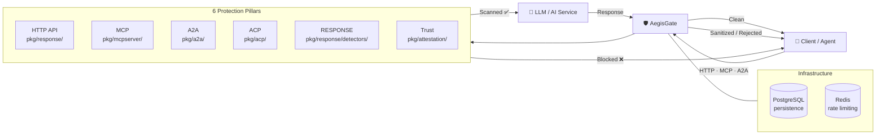

<div align="center">

# 🛡️ AegisGate Security Platform

**Secure every AI interaction. Six pillars. One gateway. Zero external dependencies.**

*A self-hosted gateway that scans every request and response between your team and any AI service — catching data leaks, prompt injections, and compliance violations before they happen.*

[](https://github.com/aegisgatesecurity/aegisgate-platform/releases/tag/v4.3.3)
[](LICENSE)
[](https://golang.org/)
[](https://github.com/aegisgatesecurity/aegisgate-platform/actions)
[](https://github.com/aegisgatesecurity/aegisgate-platform/actions)
[](docs/compliance/eu-ai-act.md)
[](#tier-gated-features)
[](#tier-gated-features)
[](https://github.com/aegisgatesecurity/aegisgate-lens)
[](https://github.com/aegisgatesecurity/aegisgate-platform/actions/workflows/ci.yml)
[](https://github.com/aegisgatesecurity/aegisgate-platform/actions/workflows/security.yml)
[](./SECURITY.md)

[🌐 Website](https://aegisgatesecurity.io) · [🚀 Live Demo](https://demo.aegisgatesecurity.io/) · [📊 Pricing](https://aegisgatesecurity.io/pricing/) · [📚 Docs](https://aegisgatesecurity.io/docs/) · [🔒 Security](SECURITY.md) · [💬 Discussions](https://github.com/aegisgatesecurity/aegisgate-platform/discussions)

</div>

> **We follow [GitHub's recommended security practices](https://securitylab.github.com/resources/five-easy-steps-to-secure-your-open-source-project/) for open source projects.** CodeQL scanning · Secret scanning with push protection · Dependabot alerts & security updates · Protected branches · RFC 9116 security policy · [Report a vulnerability →](./SECURITY.md)

---

> **🧩 Using AI without enterprise protections?** [AegisGate Lens](https://github.com/aegisgatesecurity/aegisgate-lens) is our free browser extension that brings detection patterns to everyday AI conversations — for the 95% of users who don't have a security gateway. [Install Lens →](https://github.com/aegisgatesecurity/aegisgate-lens)

> **⚡ Building AI apps with Copilot, Cursor, or Claude Code?** [AegisGate Rampart](https://github.com/aegisgatesecurity/aegisgate-rampart) is our free local proxy that intercepts AI API calls in real-time — for developers who need protection before production. [Download Rampart →](https://github.com/aegisgatesecurity/aegisgate-rampart/releases/tag/v0.6.2)

---

## What is AegisGate Platform?

AegisGate Platform is an **enterprise AI security gateway**. It sits between your organization's users, agents, and applications — and any AI service they talk to. Every request and response is scanned for security threats, compliance violations, and adversarial attacks.

Think of it as a security checkpoint for AI traffic. When someone on your team sends a prompt to ChatGPT, an MCP agent talks to an external tool, or an A2A agent escalates across a trust boundary — Platform scans it first. If it detects a leaked API key, a prompt injection, or a compliance violation, it blocks the request before it ever reaches the AI provider.

One binary. Zero external dependencies. Fail-closed by default.

### Who is it for?

- **Security teams** who need to enforce AI usage policies across the organization
- **Compliance officers** who need audit trails for HIPAA, GDPR, EU AI Act, FedRAMP, and 27 other frameworks
- **DevOps teams** who need to integrate AI security into CI/CD, SIEM, and SOAR pipelines
- **CISOs** who need visibility into what data employees are sending to AI tools — and proof for auditors

## Why AegisGate?

Every AI interaction is an attack surface. Prompt injections leak secrets. MCP servers exfiltrate context. A2A agents escalate privileges across trust boundaries. A single misconfigured LLM response can expose PII, violate compliance, or hand an attacker a credential.

AegisGate sits in front of all of it — one binary, zero dependencies, fail-closed by default — so you don't have to worry about what your team is sending to AI services.

- **Zero-cost proxy.** -2.8ms p99 overhead (faster than direct). Blocked requests resolve in 7.2ms p50. 15K+ RPS with 0% errors at 2,000 VUs.
- **Fail-closed.** If AegisGate can't scan a response, it blocks it. No silent failures, no pass-through on error.
- **Self-hosted.** No API keys to rotate, no third-party to trust. Your data stays in your infrastructure.
- **6 pillars, one gateway.** HTTP, MCP, A2A, ACP, Response, and Trust — no patchwork of point products.
- **176 detection patterns.** Secrets, XSS, PII, and compliance — wired into every response, every time. The same engine powers Lens and Rampart.
- **31 compliance frameworks.** From community basics (OWASP LLM, ATLAS, NIST AI RMF) to enterprise certifications (FedRAMP, HITRUST, TISAX, CMMC L2).

## Security Posture

| Metric | Value |
|--------|-------|
| CVEs | **0** |
| Fail-closed by default | ✅ |
| TRACE/CONNECT/TRACK blocked | ✅ |
| Security headers (CSP, CORP, COEP, COOP, HSTS) | ✅ |
| Private keys in git | **0** (rotated, gitignored, pre-commit blocked) |
| Code-scanning alerts open | **0** |
| Dependabot alerts open | **0** |

## Quick Start

### 30-Second Quickstart (Guided Setup)

```bash
# Build the binary
go build -o aegisgate-platform ./cmd/aegisgate-platform/

# Generate a config file automatically (detects your environment)
./aegisgate-platform setup --non-interactive

# Start the platform
./aegisgate-platform --config aegisgate-platform.yaml --embedded-mcp
```

The setup wizard auto-detects Docker, Kubernetes, systemd, or bare metal; recommends a deploy profile; generates a validated config; and prints next steps. No YAML editing required.

### Deploy Profiles

Instead of writing a config from scratch, use one of 5 predefined profiles:

| Profile | TLS | Rate Limit | Use Case |
|---------|-----|-----------|----------|
| `quickstart` | Off | 60 RPM | Zero-config evaluation |
| `small-team` | Auto-gen | 300 RPM | 5-50 users |
| `production` | 1.3 (bring certs) | 1,000 RPM | Hardened production |
| `high-security` | mTLS + FIPS | 5,000 RPM | Regulated industries |
| `air-gapped` | 1.3 (bring certs) | 1,000 RPM | Isolated networks |

```bash
# List all profiles
./aegisgate-platform --profile list

# Run with a profile
./aegisgate-platform --profile quickstart --embedded-mcp

# Generate a config from a profile
./aegisgate-platform setup --profile production --output my-config.yaml
```

<details>
<summary><strong>⚙️ Configuration & Maintenance Commands</strong></summary>

### Config Validation

```bash
# Validate before deploying
./aegisgate-platform config validate aegisgate-platform.yaml

# Show effective config
./aegisgate-platform config show --format json
```

### Maintenance Windows

```bash
# Enable maintenance mode (returns 503 with Retry-After)
./aegisgate-platform maintenance enable --message "Security update"

# Schedule a future window
./aegisgate-platform maintenance schedule --start "2026-09-01T02:00:00Z" --end "2026-09-01T04:00:00Z" --reason "Quarterly patch"

# Disable
./aegisgate-platform maintenance disable
```

### Other Quick Starts

```bash
# Run with defaults (in-memory stores)
./aegisgate-platform --embedded-mcp

# Run with a specific config file
./aegisgate-platform --config configs/enterprise.yaml --embedded-mcp

# Integration tests
go test -tags=integration -timeout 300s ./tests/integration/...
```

</details>

## Request Flow


```mermaid
flowchart LR
    Client["👤 Client / Agent"] -->|"HTTP · MCP · A2A"| Gateway["🛡️ AegisGate"]

    subgraph Pillars["6 Protection Pillars"]
        direction TB
        HTTP["HTTP API<br/>pkg/response/"]
        MCP["MCP<br/>pkg/mcpserver/"]
        A2A["A2A<br/>pkg/a2a/"]
        ACP["ACP<br/>pkg/acp/"]
        RESP["RESPONSE<br/>pkg/response/detectors/"]
        TRUST["Trust<br/>pkg/attestation/"]
    end

    Gateway --> Pillars
    Pillars -->|"Scanned ✅"| LLM["🤖 LLM / AI Service"]
    Pillars -->|"Blocked ❌"| Client

    LLM -->|"Response"| Gateway
    Gateway -->|"Clean"| Client
    Gateway -->|"Sanitized / Rejected"| Client

    subgraph Infra["Infrastructure"]
        PG[("PostgreSQL<br/>persistence")]
        Redis[("Redis<br/>rate limiting")]
    end

    Gateway --- Infra
```

## 6 Pillars

| Pillar | Package | Description |
|--------|---------|-------------|
| HTTP API | `pkg/response/` | Request/response scanning, PII redaction, secret masking |
| MCP | `pkg/mcpserver/` | Model Context Protocol guardrails |
| A2A | `pkg/a2a/` | Agent-to-Agent protocol security |
| ACP | `pkg/acp/` | Agent Capability Policy enforcement |
| Response | `pkg/response/detectors/` | 176-pattern detection (secrets, XSS, PII, compliance) |
| Trust Framework | `pkg/attestation/` | Cryptographic attestation, CISO posture digest (Professional+: full trust scoring) |

## Detection Engine

The `pkg/response/detectors/` package provides 176 regex patterns — the same detection engine that powers Lens and Rampart:

| Category | Patterns | What it catches |
|----------|----------|-----------------|
| **Secrets** | 45 | AWS keys, GitHub PATs, Stripe keys, JWTs, GitLab tokens, Twilio, SendGrid, private keys |
| **XSS** | 12 | `<script>`, event handlers, `javascript:`, SVG-based, encoded variants |
| **PII (US Core)** | 15 | SSN, phone, DOB, MRN, ZIP+4, full names with context |
| **PII (Extended)** | 13 | Email, IP addresses, passport numbers, driver's licenses |
| **PII (International)** | 9 | National IDs (NHS, SIN, TFN, IRD, BSN, CF, SSN-IT, NRIC, MyNumber) |
| **PII (Financial)** | 24 | Credit cards, IBANs, SWIFT/BIC, routing numbers |
| **Compliance** | 35 | GDPR data types, HIPAA PHI indicators, PCI-DSS card data, CCPA personal info |

```go
import "github.com/aegisgatesecurity/aegisgate-platform/pkg/response/detectors"

// Scan all 176 patterns
matches := detectors.DetectAll(text)

// Scan by category
secrets := detectors.DetectSecrets(text)
xss := detectors.DetectXSS(text)
pii := detectors.DetectPIIUSCore(text)
compliance := detectors.DetectCompliance(text)

// Wired into ResponseGuard (default: enabled)
guard := response.NewResponseGuard()
result, _ := guard.Scan(ctx, text)
// result.DetectedXSS, result.DetectedCompliance, result.DetectedPII, result.DetectedSecrets
```

## Open-Core Model

AegisGate is **open-core**: the community edition is Apache 2.0 open source, and enterprise features are proprietary.

| Edition | License | Features |
|---------|---------|----------|
| **Community** (free) | Apache 2.0 | HTTP/MCP/A2A/ACP/Response scanning, 176 detection patterns, 4 community compliance frameworks, in-memory + file persistence |
| **Developer** ($79/mo) | Proprietary | + 6 regulatory frameworks (HIPAA, PCI, SOC 2, ISO 27001, CCPA, GDPR), PostgreSQL persistence, SSO |
| **Professional** ($499/mo) | Proprietary | + 16 frameworks (4 security foundation + 12 industry) (EU AI Act, NIST CSF, FIPS, CIS, SOX, etc.), Trust Framework, SIEM (11 platforms), ML threat detection, federated IOC, PostgreSQL |
| **Enterprise** (custom) | Proprietary | + 5 regulated frameworks (FedRAMP, CMMC L2, NIST 800-171, HITRUST, TISAX), HSM, FIPS mode, air-gapped, K8s clustering, custom ML, 24×7 support |

Enterprise features are gated via `//go:build enterprise` build tags and tier checks in `pkg/tier/tier.go`. The community edition compiles standalone (CGO_ENABLED=0, no ONNX Runtime) and returns clear `ErrEnterpriseOnly` / `codes.Unimplemented` responses when features above the licensed tier are invoked. See [Pricing →](https://aegisgatesecurity.io/pricing/)

### Pricing Tiers

| Tier | Price | Rate Limits (Proxy/MCP) | Users / Agents | Compliance | Key Features |
|------|-------|------------------------|---------------|------------|--------------|
| **Community** | Free | Soft-throttle | 5 / 5 | 4 frameworks | HTTP/MCP/A2A scanning, 176 detection patterns, in-memory persistence |
| **Developer** | $79/mo | 1,000 / 500 RPM | 25 / 25 | 10 frameworks | + HIPAA, PCI, SOC 2, ISO 27001, CCPA, GDPR, PostgreSQL |
| **Professional** | $499/mo | 10,000 / 5,000 RPM | 100 / 100 | 26 frameworks | + EU AI Act, NIST CSF, FIPS, CIS, SOX, Trust Framework, SIEM (11 platforms), ML threat detection |
| **Enterprise** | Custom | Unlimited | Unlimited | 31 frameworks | + FedRAMP, HITRUST, TISAX, CMMC L2, HSM, FIPS mode, air-gapped, K8s clustering, custom ML |

### Vertical Bundles

| Bundle | Target | Frameworks Included |
|--------|--------|-------------------|
| Healthcare | HIPAA-covered entities | HIPAA, HITECH, HITRUST, FedRAMP |
| Defense | DoD/defense contractors | CMMC L2, NIST 800-171, FedRAMP, TISAX |
| Finance | Financial services | PCI-DSS, SOX, GLBA, FFIEC, ISO 27001 |
| Privacy | Privacy-focused orgs | GDPR, CCPA, ISO 27001, EU AI Act |
| Energy | Energy/critical infra | NERC CIP, ISO 27001, NIST CSF |
| SaaS B2B | SaaS providers | SOC 2, ISO 27001, CSA STAR, CCPA |
| EU Compliance | EU organizations | EU AI Act, GDPR, ISO 27001, TISAX |

See [Pricing →](https://aegisgatesecurity.io/pricing/) for full details.

<details>
<summary><strong>📋 Compliance Coverage (31 Frameworks, 2,043 Controls)</strong></summary>

2,043 total controls across 31 frameworks. **1,457 automated** (71.3%), 586 manual (28.7% — organizational, legal, physical, HR, governance, and policy controls that require human processes).

Automation methods: Config State Verification, Audit Trail Evidence, Detection Engine State, Cross-Framework Mapping.

| Framework | Tier | Package |
|-----------|------|---------|
| OWASP LLM Top 10 | Community | `pkg/compliance/community/owasp/` |
| MITRE ATLAS | Community | `pkg/compliance/community/atlas/` |
| NIST AI RMF | Community | `pkg/compliance/nist_ai_rmf/` |
| OWASP Web | Community | `pkg/compliance/owasp_web/` |
| GDPR | Developer | `pkg/compliance/community/gdpr/` |
| HIPAA | Developer | `pkg/compliance/hipaa/` |
| PCI-DSS | Developer | `pkg/compliance/pci/` |
| SOC 2 Type II | Developer | `pkg/compliance/soc2/` |
| ISO 27001 | Developer | `pkg/compliance/iso27001/` |
| CCPA | Developer | `pkg/compliance/ccpa/` |
| EU AI Act | Professional | `pkg/compliance/eu-ai-act/` |
| FedRAMP (NIST 800-53) | Enterprise | `pkg/compliance/fedramp/` |
| NIST CSF | Professional | `pkg/compliance/nist_csf/` |
| NIST 800-171 | Professional | `pkg/compliance/nist800171/` |
| FIPS 140-2 | Professional | `pkg/compliance/fips/` |
| CIS Controls | Professional | `pkg/compliance/cis/` |
| CSA STAR | Professional | `pkg/compliance/csa_star/` |
| NIST AI 600-1 | Professional | `pkg/compliance/nist_ai_600_1/` |
| SOX | Professional | `pkg/compliance/sox/` |
| GLBA | Professional | `pkg/compliance/glba/` |
| NERC CIP | Professional | `pkg/compliance/nerc_cip/` |
| CJIS | Professional | `pkg/compliance/cjis/` |
| FERPA | Professional | `pkg/compliance/ferpa/` |
| HITECH | Professional | `pkg/compliance/hitech/` |
| FFIEC | Professional | `pkg/compliance/ffiec/` |
| TSA SD | Professional | `pkg/compliance/tsa_sd/` |
| ISO 21434 | Professional | `pkg/compliance/iso21434/` |
| ISO 42001 | Professional | `pkg/compliance/iso42001/` |
| CMMC Level 2 | Enterprise | `pkg/compliance/cmmcl2/` |
| HITRUST CSF | Enterprise | `pkg/compliance/hitrust/` |
| TISAX | Enterprise | `pkg/compliance/tisax/` |

</details>

## Tier-Gated Features

The following features are gated by tier in `pkg/tier/tier.go`. Community edition
returns clear `ErrEnterpriseOnly` / `codes.Unimplemented` responses for features
above the licensed tier.

### Professional+ Features

| Feature | Description |
|---------|-------------|
| **SIEM Integration** | Forward audit events to Splunk, Elasticsearch, QRadar, Sentinel, SumoLogic, LogRhythm, ArcSight, Syslog, Datadog, CloudWatch, SecurityHub (11 platforms) |
| **ML Threat Detection** | Char CNN-BiLSTM neural network (1.58M params, ONNX) for adversarial pattern detection with 100/100 evasion resistance |
| **Trust Framework** | Cryptographic agent identity, per-session trust scoring, pillar-based governance, and signed attestations |
| **Federated IOC** | Cross-organization indicator-of-compromise sharing |
| **Incident Response** | Automated playbook-driven incident management (14 default playbooks) |
| **CISO Posture Digest** | Signed posture digest with IOC, audit, and posture sources |
| **Trust Portal** | Public-facing trust page with posture, frameworks, and uptime snapshots |

### Enterprise Features

| Feature | Description |
|---------|-------------|
| **HSM Support** | Hardware Security Module integration for key management |
| **FIPS 140** | FIPS 140-2/140-3 cryptographic compliance mode |
| **Air-Gapped Deployment** | Fully offline deployment for regulated environments |
| **Kubernetes Clustering** | Multi-node clustering with Helm charts |
| **VM Sandboxing** | VM-level sandboxing for MCP agent isolation |
| **Custom ML Models** | Customer-supplied ML models for threat detection |

## How AegisGate Compares

| Capability | AegisGate | Generic AI Firewalls |
|------------|-----------|----------------------|
| HTTP API scanning | ✅ Native | ✅ |
| MCP guardrails | ✅ Native | ❌ Plugin or missing |
| A2A protocol security | ✅ Native | ❌ Not supported |
| ACP enforcement | ✅ Native | ❌ Not supported |
| Response scanning (176 patterns) | ✅ Built-in | ⚠️ Limited or external |
| Cryptographic attestation | ✅ Native | ❌ Not available |
| Self-hosted, zero dependencies | ✅ Single binary | ❌ Requires external services |
| Fail-closed by default | ✅ | ⚠️ Often fail-open |
| 31 compliance frameworks | ✅ | ⚠️ 3–5 typical |
| PostgreSQL + file persistence | ✅ | ⚠️ Cloud-locked |
| HA clustering | ✅ Enterprise+ | ⚠️ Enterprise add-on |
| Open-core (Apache 2.0 community) | ✅ | ❌ Proprietary |

<details>
<summary><strong>🏗️ Architecture (Full Package Layout)</strong></summary>

```
cmd/aegisgate-platform/     # Binary entry point
pkg/
├── a2a/                    # Agent-to-Agent security
├── acp/                    # Agent Capability Policy
├── analytics/              # Token usage and request metrics
├── attestation/            # Cryptographic attestation (RFC 3161 TSA)
├── audit/                  # Audit logging + SIEM dispatcher (enterprise: full SIEM)
├── audit/soc2/             # SOC 2 evidence collection
├── bridge/                 # Platform bridge for Lens integration
├── compliance/             # 31 framework modules across 33 subdirectories
├── cluster/                # HA clustering & distributed rate limiting
├── correlation/            # Event correlation engine
├── cve/                    # CVE-for-AI feed
├── digest/                 # CISO posture digest
├── evidence/               # Evidence collection and packaging
├── grpc/                   # gRPC service layer (7 services, 50 RPCs)
├── incident/               # Incident response (PostgreSQL + in-memory, 14 playbooks)
├── ioc/                    # IOC management and STIX export
├── lensbackend/            # Lens extension backend
├── mcpserver/              # MCP guardrails
├── metrics/                # Prometheus metrics
├── ml/                     # ML threat detection (enterprise: ONNX inference)
├── persistence/            # Storage backends (file + PostgreSQL)
├── platformconfig/         # Configuration with hot-reload
├── posture/                # Security posture assessment
├── promptcache/            # Prompt caching
├── rbac/                   # Role-based access control
├── response/               # 6-pillar response guard
├── response/detectors/     # 176-pattern detection engine
├── scanner/                # Vulnerability scanner
├── security/               # Security utilities
├── signature_verification/ # Package signature verification
├── sla/                    # SLA tracking
├── soc/                    # SOC detection patterns
├── sso/                    # SSO/OIDC
├── tier/                   # Tier definitions and feature gating
├── tieradapter/            # Tier adapter for runtime tier checks
├── toolauth/               # MCP tool authorization matrix
├── trustportal/            # Trust portal HTTP handlers (enterprise: full portal)
└── upstream/               # Vendored upstream packages (proxy, dashboard, opsec)
```

</details>

## Testing

```bash
# Unit tests (81.5% coverage, 8200+ tests across 441 files)
go test ./...

# Integration tests (requires Docker for PostgreSQL testcontainers)
go test -tags=integration -timeout 300s ./tests/integration/...

# Coverage report
go test -coverprofile=coverage.out ./...
go tool cover -func=coverage.out | grep total
```

## License

Apache 2.0 for the community edition — see [LICENSE](LICENSE). Enterprise features are proprietary and require a license key.

## Security

See [SECURITY.md](SECURITY.md) for vulnerability reporting.

---

<div align="center">

[🌐 AegisGate Security](https://aegisgatesecurity.io) · [✉️ support@aegisgatesecurity.io](mailto:support@aegisgatesecurity.io) · [🐦 X/Twitter](https://x.com/aegisgate) · [🐘 Mastodon](https://mastodon.social/@aegisgate)

Made with 🖤 by AegisGate Security developers to secure the AI attack surface.

</div>